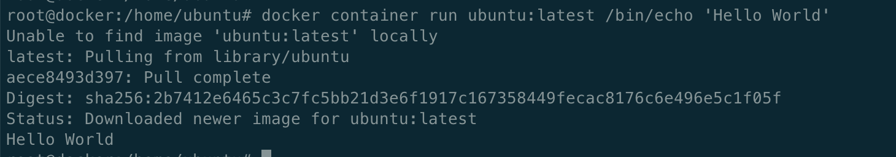

# 완벽한 인프라 구축을 위한 Docker

1. 시스템과 인프라의 기초

퍼블릭클라우드 - 인터넷을 통해 불특정다수에게 제공되는 클라우드 서비스

프라이빗클라우드 - 특정 기업/그룹에 클라우드를 제공되는 클라우드 서비스

어떤 형태의 클라우드를 사용하는 지는 요구사항에 따라 달라진다.

클라우드의 장점은 초기 투자비용이 저렴하고, 사용량이 증가하면 빠르게 대응이 가능하다.

클라우드가 적합한 케이스

1. 트래릭 변동이 많은 시스템
    
    트래픽의 변동이 적으면 온프램으로 구성하면 되지만 트래픽을 계산은 쉽지가 않다.
    
2. 재해 대책으로 해외에 백업을 구축하고 싶은 시스템
    
    퍼블릭클라우드는 리전이 여러나라에 있기 때문에  해외에서 백업시스템을 가동시켜 업무를 계속할 수 있게한다.
    
3. 서비스를 빨리 제공하고 싶은 시스템
    
    신규 서비스를 빠르게 제공하고 싶으면 기획~ 릴리즈까지 시간이 소요되는데 그중 릴리즈에 필요한 장비 조달에 있어 퍼블릭클라우드가 효율적이다. 
    

온프레미스가 적합한 케이스

1. 높은 가용성이 필요한 시스템
    
    클라우드가 보장하는 가용성보다 높은 수준의 가용성이 필요하다면, 온프레미스를 사용하자
    
2. 기밀성이 높은 데이터를 다루는 시스템
    
    데이터 저장은 클라우드 서비스 측에서 정합니다. 물리적인 저장소를 명확하게 알 수 없는 문제가 있다.
    
3. 특수한 요구사항이 있는 시스템
    
    범용적인지 않은 디바이스나 특수한 플렛폼에서만 동작하는 시스템등을 클라우드에서 처리해주지 않는 경우.
    

시스템 기반 구축/ 운용 흐름

시스템화 계획, 요구사항 정리 → 인프라 설계 → 인프라 구축 → 운용

시스템화 계획, 요구사항 정리

1. 시스템 구축 범위 선정
2. 인프라 요구사항 정의
3. 예산 책정
4. 프로젝트 체계화
5. 기존 시스템과의 연계
6. 시스템 마이그레이션 계획

인프라 설계 단계

1. 인프라 아키텍처 설계 
2. 네트워크 트폴로지 설계
3. 장비 선택/조달
4. os,미들웨어 선택
5. 시스템 운용 설계
6. 시스템 마이그레이션 설계

인프라 구축 단계

1. 네트워크 부설
2. 서버설치
3. os 셋업
4. 미들웨어 셋업
5. 애플리케이션 및 라이브러리 설계
6. 테스트
7. 시스템 릴리즈 및 마이그레이션 >퍼블릭클라우드에서는 필요없는  경우가 있음

운용단계

1. 서버 프로세스/ 네트워크 /리소스/배치 잡 모니터링
2. 데이터 백업 및 정기 유지보수
3. os 미들웨어 버전 업그레이드
4. 애플리케이션 버전 업그레이드
5. 시스템 장애 시 대응
6. 사용사 서포트

1. **컨테이너 기술과 도커의 개요**

컨테이너 기술 개요 

호스트 OS에 논리적인 구획을 만들고 애플리케이션을 작동시키기 위한 라이브러리나 애플리케이션등을 하나로 모아 마치 별도의 서버인 것처럼 사용할 수 있게 만든 것

컨테이너와  가상화기술의 차이점은 컨테이너는  애플리케이션의 실행 환경을 모음으로써 이식성을 높히고 확장성이 좋은 환경에서 동작하는 것을 지향하고 가상화는  대부분은 서로 다른 환경을 어떻게 효육적으로 에뮬레이트할지라는 지향점이 다르다.

프로그래머에게 docker

인프라환경을 컨테이너로 관리합니다. 애플리케이션의 실행에 필요한 모든 파일 및 디렉토리를 컨테이너로서 모아버리는 것입니다. 이저한 컩테이너의 바탕이 되는 docker 이미지를  docker hub와 같은 레포지토리에서 공유합니다.

프로그래머는 docker를 사용하여 개발 어플리케이션 실행에 필요한 모든 것이 포함되어 있는 docker 이미지를 생성하고  개발/테스트 환경을 통일 시켜 빠르게 확인 가능하다. -지속적 딜리버리

로컬 피씨나 다른 환경에서도 도커만 있으면 실행환경을 만들 수 있다. - 이식성이 좋다.

docker의 기능 

1. 이미지를 만드는 기능
2. 이미지를 공유하는 기능
3. 컨테이너를 작동시키는 기능

1. 이미지를 만드는 기능 (build)

도커는 애플리케이션의 실팽에 필요한 프로그램 본체 라이브러리 미들웨어 os 나 네트워크 설정을 하나로 모아 이미지를 만듭니다.  이미지는 컨테이너 실행에  바탕이되고 하나의 이미지에는 하나의 애플레이션만 넣어주고 여러개의 컨테이너를 조합하여 서비스를 구축한다.

이미지는 tar파일로 출력 할 수 있다. 도커 명령어를 사용하여 수동으로 생성이가능하고 Dockerfile에 설정 파일을 만들어 그것을 바탕으로  자동으로 이미지를 생성할 수 있다.  인테그레이션과 딜리버리 관점에서 코드에 의한 인파라 구성을 생각하면 도커파일로 관리하는게 바람직하다.

1. 이미지를 공유하는 기능

도커 이미지는 레지스트리에 저장되고 공유 가능하다.  도커 허브에서 기본 Os 인스턴스를 기반으로 새로운 이미지를 생성하고 공유 가능하다. 도커 명령어를 통해 레지스트리의 이미지를 검색하거나 다운로드 가능하다.

도커허브는 깃허브나 bitbucket와 연계도 가능하다.  깃허브에 도커파일을 관리하고 이미지를 자동으로 생성하여 도커 허브에서 공개하는것도 가능하다 . 이를 오토메이트 빌드라한다.

1. 도커 컨테이너를 동작시키는 기능 

도커는 리눅스 상에서 컨테이너 단위로 서버 기능을 동작시킵니다.

도커는 하나의 리눅스 커널을 여러개의 컨테이너에서 공유하고 있스습니다. 컨테이너 안에서 동작하는 프로세스를 하나의 그룹으로 관리하고 그룹만다 각 파일 시스템이나 호스트명 네트워크 등을 할당하고 있습니다. 그룹이 다르면 프로세스나 파일에 대한 엑세스를 할 수 없고 이러한 구조를 사용하여 컨테이너를 독립된 공간으로서 관리하고 있습니다. 이를 실행하기 위해 리눅스 커널 기능 (namespace,cgroup) 기술을 사용합니다.

Docker 에디션

CE

무료 도커 에디션이고 로컬 환경에서 사용하는 경우  및 상용 지원이 불필요한 환경에서 애플리케이션 실행환경을 이용할 때  적합합니다. ce에서는 Docker 컨테이너 작동하는 애플리케이션을 구축 및 테스트 실행행하기 위한 툴 중심으로 멀티호스트 환경에서 환경 구축을 하는 툴들이 제공됩니다.

EE 

엔터플라이즈 에디션은  도커사가 지원하고 사용 이용에 적합한 에디션입니다. 베이직  스탠다드 어드벤스드 3가지가 있고, 순서의 차이로 보면  인증이 끝난 컨테이너, 인증이 완료된 플러그인을제공 → LDAP AD와 통합된 기능 → 보안 기능 제공

지원플랫폼

os  우분투 데미안 센트 페도라

클라이언트 OS   윈도우/ macOS

iot/arm 아키텍처에서 동작하는 디바이스인 경우  docker community edition을  이용가능  우분투와 데미안 지원

릴리스

버전 번호는  연도2자리, 월2자리로 표시됨

Docker 컴포넌트

엔진 - 이미지 생성/컨테이너 기동  도커 명령어나 도커파일에 의한 이미지 새엇ㅇ

레지스트리-이미지를 공개 및 공유하기 위한 레지스트리 기능

컴포스 - 여러개의 컨테이너 구성 정보를 코드로 정의하고, 명령어를 실행함으로써 애플리케이션의 실행환경을  구성하는 컨테이너들을 일원 관리하기 위한 툴

머신 - 로컬 호스트인  Ec2  에저와 같은 클라우드 환경에서  도커의 실행 환경을 명령어로 자동화 생성 윈한 툴

스왐- 클러스터 관리 

컨테이너를 구획화하는 장비

컨테이너를 독립적인 환경을 만들기 위한  커널의 namespace의 기능을 사용

리눅스는  커널의 네임스페이스 기능을 오브젝트에  이름을 붙임으로써 6개의 독립된 환경을 구축한다.

1. PID - 각프로세스에 할당된 고유한 아이디 namepsece가 다른 프로세스끼리 서로 엑세스할 수 없습니다.
2. Network Namespce  - 네트워크 디바이스로 아이피 포트번호 라우팅 테이블 필터링 테이블과 같은  격리된 네임스페이스마다  독립적으로 가질수 있다.
3. UID - 사용자  그룹 네임스페이스 별로 독립적으로 가질 수 있습니다 예로 네임스페이스안에서는 uid/gid 가 0인 루느 사용자를 호스트 os상에는 일반 사용자로 취급할 수 있다.네임스페이스 안에  관리자 계정은 호스트os에 관여하지 않아 보안적으로 뛰어나게 격리가능 
4. Mount - 파일 시스템을 사용하기 위해 마운트가 필요하다.  다른 네임스페이스에서 수행한 마운트는 호스트 os나 다른 네임스페이스에서 엑세스 불가하다.
5. UTS  - 네임스페이스별로 호스트명이나 도메인명을 독자적으로 가질 수 있다.
6. IPS - 프로세스 간 통신을 독립적으로 가져갈 수 있다.

릴리스 관리 장치 (c groups)

도커에서 물리 머신 상의 자원을 여러 컨테이너가 공유하여 작동하다. 이때 커널 기능인  control groups 기능을 사용하여 자원의 할당 등을 관리합니다.

리눅스에서는 프로그램을 프로세스로서 실행합니다. 프로세스는 하나 이상의 스레드 모음으로 움직입니다. 씨그룹는 프로세스와 스레드를 그룹화하여 그 그룹안에 존재하는 프로레스와 스레드에 대한 관리를 수행하기 위한 기능입니다.  ex) host os의 cpu나 메모리와 같은 자원에 대한  그룹별로 제한을 둘 수 잇다. cgroups로 컨테이너 안의 프로레스에 대한 자원을 제한함으로써 예를 들면 어떤 컨테이너가 호스트os의 자원을 모두 사용해버려서 동이한 호스트 os상에 기동되는  다른 컨테이너에 영향을 주지 않도록 막을 수 있다

cgroup 서브 시스템

1. cpu - cpu 사용량 제한
2. cpuacct - 상용량 통계 정보 
3. cpuset -메모리 배치를 제어
4. memory - 메모리나 스왑 사용량 제한
5. devices - 디바이스에 대한 엑세스 허가/거부
6. freezer -그룹에 속한 프로세스 정치/재개
7. net-cls - 네트워크 제어 태그 부여
8. bikio - 블록디바이스 입출력량 제어

네트워크 구성(가상 브리지 /가상 NIC)

Docker 설치를하면 서버 물리 NIC이 docker0이라나는 가상 브리지 네트워크로 연결됩니다. Docker0은 도커를 실행시킨 후에 디폴트로 만들어지고 컨테이너에 172.17.0.0/16 서브넷 마스크를 가진 프라이빗 아이피 주소가 eth0으로 자동 할당됩니다.  가상NIC은 OSI참조 모델의 레이어 2인 가상 네트워크인터페이스로 페어인 NIC와 터널링 통신을 합니다.

도커 컨테이너와 외부 네트워크 통신을 할때는 가상 브리지 docker0과 호스트 os의 물리NIC에서 패킷을 전송하는 장치가 필요하다. 도커에서는 NAPT 기능을 사용하여 연결합니다.

NAPT는 하나의 IP주소를 여러 컴퓨터가 공유하는 기술로  IP주소와 포트번호를 반환 하는 기능입니다. 프라이빗 아이피 주소와 글로벌 아이피 주소를 투과적으로 상호 변환 하는 기술로 TCP /IP 포트 번호까지 동적으로 변환하기 때문에 하나의 글로벌 아이피 주소로 여러 대의 머신이 동시에 연결할 수 있습니다. Docker에서는 NAPT에 리눅스 iptables를 사용합니다.

NAT와 IP 마스커레이드 차이

프라이빗 아이피주소와 글로벌 아이피 주소를 변환하여 프라이빗 아이피 주소가 할당된 컴퓨터에 대해 인터넷 엑세스를 가능하게 할 때 사용하는 기술로 NAT와 IP 마스커레이드가 있다.

NAT는  프라이빗 아이피 주소가 할당된 클라이언트가 인터넷상에 있는 서버에 엑세스할때 NAT라우터를 클라이언트의 프라이빗 아이피 주소를 NAT 가 갖고 있는 글로벌 아이피로 변환하여 요청을 전송합니다.

응답은 NAT 라우터가 송신처를 클라이언트의 프라이빗 주소로 변환하여 송신합니다.

이러한 주소 변환에 의해 프라이빗  네트워크상의 컴퓨터와 인터넷상의 서버 간의 통신이 성립이됩니다. 그런데 NAT의 경우 글로벌 IP주소와 프라이빗 IP 주소를 1:1로 변환하기 때문에 동시에 여러 클라이언트가 엑세스 할 수 없습니다.

NAPT(Network Address Port Translation)

프라이빗 아이피 주소와 함께 포트 번호도 같이 반환하는 기술, 프라이빗 아이피 주소를 글로벌 아이피로 젼환할 때 프라이빗 아이피 주소별로 서로 다른 포트 번호를 변환합니다.

예 클라이언트 A가 요청을 보낸 포트 번호 1500으로 하고, 클라이언트 B가 보낸 요청은 포트번호 1600으로 합니다. 인터넷상의 서버로 부터 NAPT의 글로벌 아이피 주소의 서로 다른 포트 번호 앞으로 응답이 되돌아 옵니다. NAPT포트 번호를 바탕으로 프라이빗 IP주소로 변환 할 수 있습니다.

Docker 이미지의 데이터 관리 장치

어떤 데이터를 복사할 필요가 생겼을 때는 새로운 빈 영역을 확보하고 거기에 복사합니다.

그런데 만일 복사한 데이터에 변경이 없었다면 그 복사는 쓸데없는 것이 됩니다. 복사한 데이터의 용량이 크면 클수록 쓸데없는 낭비가 발생.   복사를 요구 받아도 바로 복사하지 않고 원래의 데이터를 그대로 참조시켜 원본 또는 복사 어느쪽에 수정이 가해진 시점에 비로소 새로운 빈영역을 확보하고 데이터를 복사합니다.

이러한 장치를 Copy on Write라고 부릅니다.  도커에서는 해당 방식으로 이미지를 관리합니다.

도커의 이미지를 관리하는 스토리지 디바이스로는 아래와 같다.

AUFS - 다른 파일 시스템의 파일이나 디렉토리를 투과적으로 겹처서 하나의 파일 트리를 구성할 수 있는  파일 시스템

Btrfs - 리눅스용 파일 시스템으로 오라클에 의해 발표되었고   롤백기능이나  특정 시점에서의 상태를 저장할 수 있는 스냅샷기능이 존재

Device Mapper - 리눅스의 블록 디바이스 드라이버와 그것을 지원한는 라이브러리들입니다.  파일시스템 블록 i/o와 디바이스의 매핑 관계를 관리합니다.  thin provisioning , snapshot기능이 있음

OverlayFS - 유니온FS중 하나로 파일 시스템에 다른 파일 시스템을 투과적으로 머징하는 장치, 커널 3.18에 도입되어 읽기 전용 파일 시스템에 읽어 들이기 가능한 파일 시스템을 겹침으로써 읽기 전용 파일 시스템상의 디렉토리나 파일에 대한 읽어들이기 변경이 가능해진다. 도커에서는 overlay,overlay2라는 2종류의 드라이버를 사용할 수 있다. overlay2는 커널 4.0에서 사용가능 

**3 도커 설치**

Linux 설치

환경 : ubuntu

설치

```jsx
#apt 업데이트
 apt-get  update

#패치지 설치
 apt-get install -y\
 apt-transport-https\
 ca-certificates\
 curl\
 software-properties-common

#GPG키 추가
curl -fsSL https://download.docker.com/linux/ubuntu/gpg |sudo apt-key add -
# 결과 OK

#GPG 키 확인
sudo apt-key fingerprint 0EBFCD88

#레포지토리 등록
sudo add-apt-repository \
"deb [arch=amd64] https://download.docker.com/linux/ubuntu \
$(lsb_release -cs) \
stable"

sudo apt-get update

#도커설치
sudo apt-get install docker-ce

```

Docker 명령어 예제

```jsx
docker container run [image] [실행할 명령어]

#Ex )  docker container run ubuntu:latest /bin/echo 'Hello World'
```



이미지가 서버에 존재하지 않아  image 다운로드  > docker hub repository에서 다운로드 됨

/bin/echo ‘Hello World’ 명령어 실행

-버전 확인

```jsx
docker version
```


도커는 클라이언트/서버 아케텍처 채택하고 있어 Docker 클라이언트와 서버 Remote APIㄹ을 경유하여 연결되어 있습니다.

-Docker 실행 환경 확인 (docker system info)


컨테이너 수 / 버전/ 스토리지 드라이버 종류 / os 종류 / 아키텍처 확인이 가능하다.

-Docker 디스크 이용 상황 (docker system df)

```jsx
docker system df
```


구체적을 확인은 -v를 추가한다.

-Docker image 다운로드

```jsx
#docker pull nginx
```


```jsx
#이미지 리스트 확인
docker images 
```


-다운로드 받은 nginx이미지로 컨테이너 생성 / 동작확인

```jsx
#컨테이너 생성
docker container run  --name webserver -d  -p 80:80 nginx
#상태 확인
docker ps
#동작확인
docker status webserver
```


-기동정지

```jsx
docker stop webserver
docker start webserver
```


1. **Docker 명령어**

4.1 이미지 조작

Docker hub

Docker hub는 깃허브나 bitbucket과 같은 소스관리 툴관 연계하여 코드를 빌드하는 기능이나 실행 가능한 애플리케이션의 이미지를 관리하는 기능을 갖춘  docker 의 공식 리포지토리 서비스입니다.

도커 이미지 저장/ 조회 

```jsx
#특정버전
docker  image pull centos:7
#모든 버전
docker images pull -a centos
$텐서플로우의 URL을 지정하여 취득
docker  image pull gcr.io.tensorflow/tensorflow

docker image ls
옵션
-a  모든 이미지 표시
--digests  다이제스트를 표시
--no-trunc  결과를 모두 표시
--q  아이디만 표지

*다이제스트 : 이미지를 고유하게 식별하기 위한 다이제스트가 부여됨
```

위장 변조 방지

- DCT(Docker content trust) 기능으로 정당성을 확인 가능
- 서명 : 이미지 작성자가 Docker 레지스트리에 업로드 전에 로컬환경에서 이미지 작성자의 비밀키를 사용하여 이미지에 서명합니다.  비밀키는 Offline key라고 하며 관리가 필요
- 검증  :서명이 된 이미지가 다운로드 할때 이미지 작성자의 공개키를  사용하여 이미지가 진짜인인 아닌지를 확인합니다.  만일 변조된 경우 그이미지를 무효한다.  이 공개키를 tagging key라하며  기능을 사용하려면  설정이 필요하다.

검증 설정

```jsx
$export DOCKER_CONTENT_TRUST=1
```


이미지 상세 정보확인

```jsx
docker image inspect centos:7
```


확인 해볼 값

1. 이미지 아이디 
2. 작성일
3. 도커버전
4. CPU 아키텍처

하위 내용 검색

docker image inspect --format="{{.Os}}" centos:7


이미지 태그 설정(docker  image tag)

이미지에 태그를 지정

```jsx
docker tag image  변경할 태그
```


이미지 검색 (docker search)

```jsx
docker search image_name
```


옵션

—no-trunc.  : 결과모두

—limit : N건의 검색 결과를 표시

—filter=stars=n : 즐겨찾기의 수를 지정

이미지 검색 (docker image rm)

```jsx
docker image rm
```


—f : 강제삭제

—no-prune : 중간 이미지를 삭제하지 않음

```jsx
docker image prune 이미지
```


Docker Hub에 로그인 (docker login)

```jsx
docker login [옵션] [서버]
```


옵션

-p : password

-u : user

Docker Hub 로그아웃 (docker logout)

```jsx
docker logout
```

Docker 컨테이너 생성/시작/정지

생성

```jsx
docker container create [이름] [이미지]
```

실행

```jsx
docker container run [이름] [이미지]
docker container run -it --name  [name] [이미지]  [실행할 명령어]
#백그라운드 실행
docker container run -d centos /bin/ping localhost
#컨테이너의 네트워크 설정
docker container run [테트워크 옵션] 이미지
```


-a :   표준 입출력 출력오류에 어테치한다.

—cidfile : 컨테이너 아이디를 파일로 출력한다.

—detach,-d : 컨테이너를 생성하고 백그라운드에서 실행한다.

—interactive  ,-i  : 입출력을 연다

—tty , -t : 단말기 디바이스를 사용한다.

-u : 유저명

—restart=[no |no-failute |no-failure n |always|unless-stopped] = 재시작하지 않는다|종료 스테이터스가0이 아닐때 | 0이 아닐 때 N번재시작 | 항상 재시작| 최근 컨테이너가 정지상태가 아니라면  항상 재 시작

—rm : 명령어 실행 후 컨테이너 삭제

네트워크 설정 옵션

—add-host=[호스트 주소] :컨테이너의 /etc/hosts에  호스트명과 주소를 정의

—dns =[ip add]  : 컨테이너용 DNS 서버의 ip주소 지정

—expose  :지정한 범위의 포트 번호를 할당

—max-address=[MAC Address] : MAC주소를 지정

—net=[bridge |none | container:<name|id>]|host |NETWORK]  :컨테이너 네트워크를 지정

—hostname,-h : 컨테이너 자신의 호스트명을 지정

—publish -p [호스트 포트 번호]:[컨테이너의 포트 번호] : 호스트와 컨테이너의  포트 매팽

—publish-all  : 호스트의 임의의 포트를 컨테이너에 할당

—net 옵션

bridge  : 브리지 연결 사용 (기본값)

none : 네트워크에 연결하지 않는다.

container:[name |id] :다른 컨테이너의 네트워크를 사용한다.

host :컨테이너가 호스트 OS네트워크를 사용한다.

NETWORK : 사용자 정의 네트워크를 사용한다.

지원지정 옵션

—cpu-shares , -c

—memory, -m

—volum=[호스트의 디렉토리]:[컨테이너 디렉토리] , -v

환경을 지정 

—env ,-e :  환경변수 설정

—env-file=[파일명] :환경변수를 파일로 설정

—read-only==[true | false] :컨테이너의 파일 시스템을 읽기 전용

—workdir==[패스] :컨테이너의 작업 디렉토리

—user ,-u   : 사용자명 

기동 컨테이너 목록표시 (container ls)

-a  :싱행 중/정지 중인 것도 포함하여 모든 컨테이너를 표시

-f : 표시할 컨테이너의 필터링

—format : 포멧지정

-n :마지감그올 실행된 n건의 컨테이너만 표시

-l : 마지막으로 실행된 컨테이너만 노출

-no-trunc : 정보를 생략하지 않고 표시

-q : 컨테이너 아이디만 표시

-s : 파일 크기 표시

컨테이너 기동 확인(docker container stats)

docker container stats [식별자]

컨테이너 시작  ( docker container start  [option] [container ID] )

-a  : 표준입력

-i : 컨테이너 표준 입력을 연다.

- rm/restsrt 는 동시에  사용 불가

```jsx
docker  container logs -t [타임스탬프]
```


```jsx
docker container run -d -p 8080:80 nginx
```


```jsx
docker container run -d --mac-address="11:1a:1b:1c:10:1a" centos
$결과
1dc5a77e13b831b39b44ded8b00d4973633ebc4f2f7b4f6c003189026c9544ad

docker container inspect --format="{{.Config.MacAddress}}" 1dc5a77e13b831b3
#결과
11:1a:1b:1c:10:1a
```

net

```jsx
docker network create -d bridge webap-net
aea9a7f8aebf267e45512b217121b14f41e000f3e5c83fca46e115d0345744c5

docker container run --net=webap-net -it centos
```

지원지정 옵션

cpu memory

```jsx
docker container run --cpu-shares=512 --memory=1g  centos
```

volume

```jsx
docker container run -v /home/centos/webap:/usr/share/nginx/html ngin
```

환경변수

```jsx
docker container run -it -e foo=bar centos /bin/bash
set |grep foo
#결과
foo=bar
```


```jsx
docker container run -it  --env-file=env_list  centos /bin/bash
```


```jsx
docker container run -it  -w=/tensorflow centos /bin/bash
```


실행목록

```jsx
docker container ls
```


상태확인

```jsx
docker container stats 6b1399d64a90
```


컨테이너 시작

```jsx
docker container start [식별자]
```


정지

```jsx
docker container  stop[이름] [이미지]
```


재시작

```jsx
docker container restart [식별자]
```


삭제

```jsx
docker container rm [이름] [이미지]
```


가동 컨테이너 연결 (docker container attach)

- 연결한 컨테이너를 종료는 (ctrl +c), 컨테이너 시작한 채로 컨테이너 안에서 움직이는 프로세스인 경우 (/bin/bash)는  ctrl+p +q 입력

1.  exit     > relaxed_goldberg  컨테이너 종료

2.  sad_bohr 에 대해서  /bin/bash프로세스만 종료


가동 컨테이너에서 프로세스 실행(docker container exec)

웹 서버와 같이 백그라운드에서 실행되고 있는 컨테이너에 액세스하고 싶을 때 docker container attach 명령으로 연결해도 쉘이 작동하지 않는 경우는 명령을 접수할 수 가 없습니다. 그래서 docker container exec 명령을 사용하여 임의의 명령을 실행

```jsx
docker container exec [옵션] <컨테이너 식별자> <실행할 명령> [인수]
```


가동 컨테이너의 프로세스 확인(docker container top)

webserver라는 이름의 컨테이너의 프로세스를 확인 

docker container top 명령을 실행시키면 실행 중인 프로세스의 PID와 USER, 실행 중인 명령이 표시됩니다. PID란 Linux의 프로세스 식별자로, 프로세스를 고유하게 식별하기 위한 ID


가동 컨테이너의 포트 전송 확인(docker container port)


컨테이너 이름 변경(docker container rename)

이름을 변경하려면 docker container rename 명령


컨테이너 안의 파일을 복사(docker container cp)

docker container cp 명령
docker container cp <컨테이너 식별자> :<컨테이너 안의 파일 경로>     <호스트의 디렉토리 경로>
docker container cp <호스트의 파일>        <컨테이너 식별자>: <컨테이너 안의 파일 경로>


컨테이너 조작의 차분 확인(docker container diff)

컨테이너 안에서 어떤 조작을 하여 컨테이너가 이미지로부터 생성되었을 때와 달라진 점(차분)
을 확인하려면 docker container diff 명령 사용

```jsx
docker container diff <컨테이너 식별자>
```


---

---

**이미지 생성**

---

컨테이너로부터 이미지 작성(docker container commit)

```jsx
docker container commit [옵션]< 컨테이너 식별자> [ 이미지명 [: 태그명] ]
```


컨테이너를 tar 파일로 출력(docker container export)

```jsx
docker container export <컨테이너 식별자>
```


tar 파일로부터 이미지 작성(docker image import)

```jsx
docker image import <파일 또는 URI> | - [이미지명 [: 태그명]
```


이미지 저장(docker image save)

```jsx
docker image save [옵션] <저장 파일명> [이미지명]
```

저장할 파일명은 -o 옵션으로 지정


이미지 읽어 들이기(docker image load)

```jsx
docker image 1oad [옵션]
```


***export / import와 save/load의 차이**
컨테이너를 export하면 컨테이너를 작동시키는 데 필요한 파일을 모두 압축 아카이브로 모을 수 있습니
다. 그래서 이 tar 파일을 풀면 컨테이너의 루트 파일 시스템을 그대로 추출할 수 있습니다.
시험 삼아 Nginx의 공식 이미지인 'nginx'를 그대로 실행시킨 컨테이너 export-sample을 docker
container export 명령을 사용하여 export.tar 라는 이름으로 모으기 바랍니다. 

이미지를 save하면 이미지의 레이어 구조도 포함된 형태로 압축 아카이브로 모을 수 있습니다.
마찬가지로 Nginx의 공식 이미지인 'nginx'를 docker image save 명령으로 save.tar라는 이름으로 모
읍니다.

이미지는 똑같아도 docker container export 명령과 docker image save 명령
은 내부적인 디렉토리와 파일 구조가 다릅니다.
그래서 압축 아카이브에서는 docker container export 명령으로 작성한 것을 읽어 들일 때는 docker
image import 명령을, docker image save 명령으로 생성한 것을 읽어 들일 때는 docker image load 명
령을 사용하기 바랍니다.

---

불필요한 이미지/컨테이너를 일괄 삭제(docker system prune)

사용하지 않는 이미지, 컨테이너, 볼륨, 네트워크를 일괄적으로 삭제


---

Dockerfile의 기본 구문

---

Dockerfile은 텍스트 형식의 파일로, 에디터 등을 사용하여 작성합니다. 확장자는 필요 없으
며, 'Dockerfile 이라는 이름의 파일에 인프라의 구성 정보를 기술합니다. 또한 Dockerfile 이외
의 파일명으로도 작동하지만, 이때는 Dockerfile에서 이미지를 빌드할 때 파일명을 명시적으로
지정해야 합니다.


# 주석

Dockerfile에는  어떤 이미지로부터  생성할지'라는 정보를 반드시 기술, 해당 이미지는 베이스이미지라고 합니다.

```jsx
FROM [이미지명] 
FROM [이미지명]:[태그명]
FROM [이미지명]@[다이제스트]
```

예제 : 

```jsx
FROM centos:enctos7
```

```jsx
FROM nginx@sha256:10d1f5b58f74683ad34eb29287e07dab1e90f10af243f151bb50aa5dbb4d62e
```


---

Dockerile의 빌드와 이미지 레이어

```jsx
docker build -t [생성할 이미지명]:[태그명] [Dockerfile위치]
```


이미지가 아닌 Dockerfile로 구성하면  이미지를 저장하는 저장공간 및 관리에 용이하다

베이스이미지가 PC에 없으면 레포지토리에서 다운로드/  PC에 있다면 PC이미지에서 다운로드

파일이름이 Dockerfile이 아닌 경우  

```jsx
docker build -t 이미지  -f Dockerfile.base .
```

- Github에선 Dockerfile의 파일명이 아니면  이미지 자동 생성 기능이 불가능

표준 입력에서의 빌드

```jsx
docker build - < Dockerfile
```

위 경우 빌드에 필요한 파일을 포함시킬 수 없어 ADD명령으로 이미지 안에 추가할 수 없다. Dockerfile과 빌드에 필요한 파일을 tar로 모아두고 표준 입력에서 지정

```jsx
$ tar tvfz docker.tar.gz
-2W-r--r-- docker/staff 92 2015-07-16 16:12 Dockerfile
-2W-r--r-- docker/staff  5 2015-07-16 16:13 dummyfile

s docker build - ^ docker.tar.gz
Sending build context to Docker daemon
229 B
Sending build context to Docker daemon
step 0 : FROM centos :centos7
---> 7322fbe74aa5
Step 1 : MAINTAINER 0.1 your-nameayour-domain.com
---> Running in eb2987cbbe61
---> e3dffaea3b65
Removing intermediate container eb2987cbbe61
Step 2 : ADD durmytile /tmp/dunmyfile ---> 9aca58965f2e
Removing intermediate container 59d2a9875bga
Successfully built gacas896sf2e
```

* 중간이미지 재사용

Docker는 이미지를 빌드할 때 자동으로 중간 이미지를 생성합니다. 그리고 다른 이미지를 빌드할 때 중
간 이미지를 내부적으로 재이용함으로써 빌드를 고속으로 수행

만약 캐시사용을 원하지 않으면  —no-cache 옵션 사용


---

이미지 레이어 구조

Dockerfile을 빌드하여 Docker 이미지를 작성하면 Dockerfile의 명령별로 이미지를 작성

작성된 여러 개의 이미지는 레이어 구조로 되어있음

이미지 작성 중 step으로 나타나는 것 들이 중간 이미지 작성이다.

해당 이미지 바탕으로  여러 개의 이미지를 생성하는 경우 베이즈 이미지 레이어가 공유되고, 이미지를 겹침으로써 Docker에서는 Disk용량이  효율적으로 사용

---

Dockerfile만들기

예제

```jsx
git clone https://github.com/asashiho/dockertext2
cd dockertext2/chap05/multi-stage/
```


파일 설명

Build 이미지

Go 1.8.4 버전을 베이스 이미지를 두고 builder라는 별명(AS) 붙임

개발에 필요한  버전을 설치하여 로컬 환경에 있는 main.go파일을 컨테이너로 복사

명령어 go build로 greet라는  실행 가능 바이너리 파일을 작성

Product 이미지

busybox(기본적인 리눅스 명령어들을 하나의 파일로 모아 놓은 것)라는 이미지를 사용 , 개발용 환경의 docker이미지로 빌드한 greet라는 바이너리파일을  해당  이미지로 복사( —from 옵션을 활용하여  어느 이미지로 부터 복사할 것인지 설명)

```jsx
docker build -t greet .
docker container run -it --rm greet  asa
```

---

명령 및 데몬 실행 (RUN)

RUN은  도커이미지가 생성될 때 실행된다.

```jsx
RUN [하고 싶은 명령어]
```

RUN  사용 방법 

1. Shell 형식으로 기술

```jsx
RUN apt-get install -y nginx
```

/bin/sh -c 를 사용한 결과와 동일하게 동작

1. Exec 형식으로 기술

shell형식으로 하면 /bin/sh에서 실행되지만 exec 형식으로 기술하면 쉘을 경유하지 않고 직접 실행합니다.

명령 인수에 $HOME과 같은 환경 변수를 지정할  수 없습니다

```jsx
RUN ["/bin/bash","-c","apt-get install -y nginx"]
```

추가 예제

```jsx
FROM ubuntu:latest

RUN echo This is  a Shell
RUN ["echo" , " This is a Shell"]
RUN ["/bin/bash" "-c", "echo 'This is a Shell , It use EXEC tyep' "]
```

```jsx
docker build -t run-sample .

docker history run-sample
---
Sending build context to Docker daemon 1.307 GB step 1/4 : FROM ubuntu: latest
--->
step 2/4 : RUN echo 안녕하세요 Shell 형식입니다. --> Running in b6ebeeef246a
안녕하세요 She11 형식입니다 ---> 
Removing intermediate container-> Running in 
안녕하세요 Exec 형식입니다 --> 
Removing intermediate container 
Step 4/4 : RUN ("/bin/bash", "-c", "echo' 안녕하세요 Exec 형식에서 bash를 사용해 보았습니다' 미]
--> Running in
안녕하세요 Exec 형식에서 bash를 사용해 보았습니다 ---> 
```

실행 결과를 확인하면 Shell 형식으로 기술한 RUN 명령은 /bin/sh, Exec 형식으로 기술한 RUN 명령은 쉘을 통하지 않고 실행되는 것을 알 수 있습니다. 또한 쉘을 명시적으로 지정하고 싶을 때는 Exec 형식을 사용하면 /bin/bash를 사용하여 명령이 실행되는 것을 알 수 있습니다. 따라서 /bin/sh를 경유하여 명령을 실행하고 싶을 때는 Shel 형식으로 기술하고, 그 외의 경우는 Exec 형식으로 기술하는 것이 좋습니다.

*이미지의 레이어

```jsx
#RUN 을 여러 줄로 기입. 모든 줄이 별도 레이어로 생성
RUN yum -y install httpd
RUN yum -y install php
RUN yum -y install php-mbstring
RUN yum -y install php-pear

#RUN을 한줄로 지정하는경우  하나의 레이어만 생성됨.  \ 을 통해 줄바꿈도 가능
RUN yum -y install  httpd php php-mbsting php-pear

#예제
RUN yum -y install\
					 httpd\
           php\ 
           php-mbsting\
           php-pear
```

---

데몬실행 (CMD)

RUN은 명령은 이미지를 작성하기 위해  기술,생성된 컨테이너 안에서 명령어 실행하려면 CMD사용 

여러 줄을 적으면 마지막 줄에 유효함 

```jsx
CMD [하고 싶은 명령어]
```

RUN 명령어와 문구는 동일 

```jsx
#EXEC 형식
CMD ["nginx", "-g", "daemon off;"]
#Shell 형식
CMD nginx -g daemon off;
```

ENTRYPOINT 명령의 파라미터로 기술

```jsx
# 베이스 이미지 설정
FROM ubuntu: 16.04
# Nginx 설치
RUN apt-get -y update && apt-get -y upgrade RUN apt-get -y install nginx
# 포트 지정 
EXPOSE 80
# 서버 실행
CMD ["nginx", "-g", "daemon off;"]
```

---

데몬 실행 (ENTRYPOINT)

해당 명령어는 Dockerfile 에서 빌드한 이미지로 부터 docker컨테이너를 시작하기 때문에 docker container run 명령어를 실행했을 때 실행됨

```jsx
ENTRYPOINT [명령어]

#EXEC 형식
ENTRYPOINT ["nginx", "-g", "daemon off;"]

#SHELL 형식
ENTRYPOINT nginx -g daemon off;
```

cmd 와의 차이는  컨테이너 시작 명령어 실행 때 동작에 있다. cmd는 컨테이너 시작 시에  실행하고 싶은 명령어를 정의해도 docker run 명령어 실행 시에 인수로 새로운 명령어를 지정한 경우 이것을 우선 실행함

ENTRYPOINT는  명령에서 지정한 명령은 반드시 컨테이너에서 실행되는데, 실행 시에 명령 인수를 지정하고 싶을 때는 CMD명령과 조합하여 사용해된다. Entrypoint 명령으로 실행하고 싶을 명령 자체를 지정하고 CMD명령으로는 그명령의 인수를 지정하면, 컨테이너를 실행했을 때의 기본 동작을 결정할 수 있습니다.

ENTRYPOINT 명령과 CMD 명령을 조합한 

```jsx
# Docker 이미지 취득
FROM ubuntu: 16.04
# TOP 실행 
ENTRYPOINT ["top"]
CMD ["-d", "10"]
```

---

빌드 완료 후에 실행되는 명령(ONBUILD)

ONBUILD 명령은 그 다음 빌드에서 실행할 명령을 이미지 안에 설정하기 위한 명령입니다.
예를 들어 Dockerfile에 ONBUILD 명령을 사용하여 어떤 명령을 실행하도록 설정하여 빌드하고 이미지를 작성합니다. 그리고 그 이미지를 다른 Dockerfile에서 베이스 이미지로 설정하 여 빌드했을 때 ONBUILD 명령에서 지정한 명령을 실행시킬 수 있음

```jsx
ONBUILD [실행하고 싶은 명령]
```

예를 들면 웹 시스템을 구축할 때 OS 설치 및 환경 설정이나 웹 서버 설치 및 각종 플러그인 설치 등과 같은 인프라 환경 구축과 관련된 부분을 베이스 이미지로 작성합니다. 이때 ONBUILD 명령으로 이미지 안에 개발한 프로그램을 전개하는 명령(ADD나 COPY 명령 등)을 지정합니다.
애플리케이션 개발자는 애플리케이션의 구축 부분을 코딩하고 이미 작성이 끝난 베이스 이미 지를 바탕으로 한 이미지를 작성합니다. 이 이미지 안에는 프로그래밍이 끝난 업무 애플리케이
션이 전개됩니다.

베이스이미지 작성

```jsx
# 베이스 이미지 설정
FROM ubuntu: 17.10
# Nginx 설치
RUN apt-get -y update && apt-get -y upgrade 
RUN apt-get -y install nginx
# 포트 지정 
EXPOSE 80
# 웹 콘텐츠 배치
ONBUILD ADD website.tar /var/www/html/
#Nginx 실행
CMD ("nginx", "-g", "daemon off;"]

---
#이미지 빌드
 docker build -t web-base -f Dockerfile.base .
```

이후  이미지를 빌드하게 되면 dockerfile 위치에 있는 website.tar(html,css,파일,사진)둬 신규 빌드 시 참조하도록 한다.

```jsx
docker build -t photoview-image .
---
docker container run -d -p 80:80 photoview-image
---
#상세보기
docker image inspect --format="{{.Config.OnBuild )}" web-base
```

onbuild를 통한 개발의 예

미들웨어/인프라구축 담당자가  베이스이미지를 구축하면  동일한 환경에서 개발팀에서 개발

---

시스템 콜 시그널의 설정(STOPSIGNAL 명령)

컨테이너를 종료할 때에 송신하는 시그널을 설정하려면 STOPSIGNAL 명령

```jsx
STOPSIGNAI [시그널]
```

---

컨테이너의 헬스 체크 명령(HEALTHCHECK 명령)

프로세스가 정상적으로 작동하고 있는지를 체크하고 싶을 때는 HEALTHCHECK 명령

```jsx
HEALTHCHBCK [옵션] CMD 실행할 명령
```


```jsx
HEALTHCHBCK --interval=5m --cimeout=3s CMD cur1 -f http://1ocalhost/ || exit 1
```

과는 docker container inspect 명령 Health 상태 확인가능 

---

환경 및 네트워크 설정

환경변수 설정(ENV 명령)

Dockerfile 안에서 환경변수를 설정하고 싶을 때는 ENV 명령을 사용

```jsx
ENV [key] [value]
ENV [key]=[value]
```

key value 형으로 지정하는 경우

단일 환경변수에 하나의 값을 설정합니다. 첫 번째 공백 앞을 key로 설정하면 그 이후는 모두 문자열로서 취급합

```jsx
BNV myName "Shiho ASA"
BNV myorder Gin Whisky Calvados 
ENV myNickname miya
```

key=value로 지정하는 경우

한 번에 여러 개의 값을 설정할 때는 환경변수를 key=value로 지정

```jsx
ENV myName="Shiho ASA" \
 myorder=Gin\ Whiskyl\ Calvados\ 
 myNickName=miya
```

하나의 ENY 명령으로 여러 개의 값을 설정하므로 만들어지는 Docker 이미지는 하나

변수 앞에 |를 추가하면 이스케이프 처리를 할 수 있습니다. 예를 들어 '(SmyName은 SmyName 이라는 리터럴로 치환

ENY 명령으로 지정한 환경변수는 킨테이너 실행 시의 docker container run 명령의 --eny 옵선을 사용하면 변경

---

작업 디렉토리 지정(WORKDIR 명령)

Dockerfile에서 정의한 명령을 실행하기 위한 작업용 디렉토리를 지정하려면 WORKDIR 명령을 설정

```jsx
WORKDIR [작업 디렉토리 경로]
```

WORKDIR 명령은 Dockerfile에 쓰여 있는 다음과 같은 명령을 실행하기 위한 작업용 디렉토리를 지정

RUN 명령
CMD명령
ENTRYPOINT 명령
COPY 명령

ADD 명령

지정한 디렉토리가 존재하지 않으면 새로 작성합니다. 또한 WORKDIR 명령은 Dockerfile 안에서 여러 번 사용할 수 있습니다. 상대 경로를 지정한 경우는 이전 WORKDIR 명령의 경로에 대한 상대 경로

```jsx
#/first/second/third가 출력
WORKDIR /first 
WORKDIR second 
WORKDIR third
RUN ["pwd"]

#환경변수 예
ENV DIRPATH /first 
ENV DIRNAME second
WORKDIR $DIRPATH/$DIRNAME 
RUN ["pwd"]
```

---

사용자 지정(USER 명령)

Dockerfile의 다음과 같은 명령을 실행하기 위한 사용자를 지정할 때는USER 명령

- RUN 명령
- CMD 명령
- ENTRYPOINT 명령

```jsx
USER [사용자명/UID]

#테스트
RUN ["adduser", "asa"]
RUN ["whoami"]
USER asa
RUN ["whoami]
```


---

라벨 지정(LABEL 명령)

이미지에 버전 정보나 작성자 정보, 코멘트 등과 같은 정보를 제공할 때는 LABBL 명령

```jsx
LABEL <키 명>=<값>

#예제
LABEL maintainer "shiho AsAcasashihosmail.asa.seoul>" 
LABEL title="WebAP"
LABEL version="1.0"
LABEI description=This image is WebApplicationServer"

#결과확인
docker image inspect --format="{(.Config.Labels )}" [이미지 이름]
```

---

포트 설정(EXPOSE 명령)

```jsx
EXPOSB <포트 번호>
```

EXPOSE 명령은 Docker에게 실행 중인 컨테이너가 listen 하고 있는 네트워크를 알려줍니다. 또한 docker container run 명령의 -p 옵션을 사용할 때 어떤 포트를 호스트에 공개할지를 정의

---

Dockerfile 내 변수의 설정(ARG 명령)

Dockerfile 안에서 사용할 변수를 정의할 때는 ARG 명령을 사용합니다. 이 ARG 명령을 사용 하면 변수의 값에 따라 생성되는 이미지의 내용을 바꿀 수 있습니다. **환경변수인 BNV와는 달리 이 변수는 Dockerfile 안에서만 사용**

```jsx
ARG <이름> [=기본값]
```

Dockerfile을 빌드할 때 **--build-arg** 옵션을 붙여 ARG 명령에서 지정한 YOURNAME'에 'shiho'라는 값을 설정하면  변경 가능


---

기본 쉘 설정(SHELL 명령)

```jsx
SHELL ["쉘의 경로", "파라미터"]

# ex
# 기본 쉘 지정
SHBLL ["/bin/bash", "-c"]
# RUN 명령 실행 
RUN echo hello
```

SHELL 명령을 지정하면 그 쉘은 그 이후에 Dockerfile 안에서 Shell 형식으로 지정한 RUN 명령이나 CMD 명령, ENTRYPOINT 명령에서 유효

---

## 파일 설정

---

파일 및 디렉토리 추가(ADD 명령)

이미지에 호스트상의 파일이나 디렉토리를 추가할 때는 ADD 명령

```jsx
ADD <호스트의 파일 경로> <Docker 이미지의 파일 경로>
ADD [" <호스트의 파일 경로>""<Docker 이미지의 파일 경로>"]

#ex
ADD host.html /docker_dir/

#patten
# [hos]로 시작하는 모든 파일을 추가 
ADD hos* /docker_dir/
#[hos]+임의의 한 문자 룰에 해당하는 파일을 추가 
ADD hos?.cxt /docker_dir/

#/docker_dir 안의 web이라는 디렉토리에 bost.html을 복사
WORKDIR /docker_dir 
ADD host.html web/
```

- 

이미지에 추가하고 싶은 파일이 원격 파일 URL인 경우, 추가한 파일은 퍼미션이 600(사용자만 읽기 쓰기 가능)이 됨

ADD 명령은 인증을 지원하지 않기 때문에 원격 파일의 다운로드에 인증이 필요한 경우는 RUN 명령에서 wget 명령이나 curl 명령

```jsx
ADD http://ww.wings.msn.to/index.php /docker_dir/web/
```

실행하면 [http://www.wings.msn.to/index.php를](http://www.wings.msn.to/index.php%EB%A5%BC) 다운로드하여 Docker 이 미지 안의 /docker_dir/web/index.php로 퍼미션이 600인 파일


또한 이미지 안의 파일 지정이 파일(마지막이 슬래시가 아님)일 때는 URIL로부터 파일을 다운 로드하여 지정한 파일명을 추가합니다.
이미지 안의 파일 지정이 디렉토리(마지막이 슬래시)일 때는 파일명은 URL로 지정한 것이 됩 니다.
호스트의 파일이 tar 아카이브거나 압축 포맷(gzip, bzip2 등)일 때는 디렉토리로 압축을 풉니 다. 단, 원격 URL로부터 다운로드한 리소스는 압축이 풀리지 않으므로 주의

*빌드에 불필요한 파일 제외

Docker에서 빌드를 하면 빌드를 실행한 디레토리 아래에 있는 모든 파일이 Docker 데몬으로 전송됩니
다. 그렇기 때문에 빌드에서 제외하고 싶은 파일이 있는 경우는 'dockerignore'이라는 이름의 파일 안에 해당 파일명을 기술하기 바랍니다. 여러 개의 파일을 지정할 때는 줄 비꿈을 해서 파일명을 나열

---

파일 복사(COPY 명령)

```jsx
COPY <호스트의 파일 경로> <Docker 이미지의 파일 경로>
COPY ["<호스트의 파일 경로>" "<Docker 이미지의 파일 경로>"]
```

ADD 명령과 COPY 명령은 매우 비슷합니다. ADD 명령은 원격 파일의 다운로드나 아카이 브의 압축 해제 등과 같은 기능을 갖고 있지만, COPY 명령은 호스트상의 파일을 이미지 안으 로 복사하는' 처리만 합니다. 이 때문에 단순히 이미지 안에 파일을 배치하기만 하고 싶을 때는 COPY 명령

*Docker의 빌드에 필요 없는 파일은 Dockerile과 똑같은 디렉토리에 두지 않도록 주의

---

볼륨 마운트(VOLUME 명령)

이미지에 볼륨을 할당하려면 VOLUMB 명령

```jsx
VOLUMB["/마운트 포인트"]
```

VOLUMB 명령은 지정한 이름의 마운트 포인트를 작성하고, 호스트나 그 외 다른 컨테이너
로부터 볼륨의 외부 마운트를 수행합니다. 설정할 수 있는 값은 VOLUME ["/var/log/"]와 같은
JSON 배열, 또는 VOLUME /var/log4 VOLUME /var/log /var/db와 같은 여러 개의 인수로

된 문자열을 지정할 수 있습니다.
컨테이너는 영구 데이터를 저장하는 데는 적합하지 않습니다. 그래서 영구 저장이 필요한 데

이터는 컨테이너 밖의 스토리지에 저장하는 것이 좋습니다.
영구 데이터는 Docker의 호스트 머신상의 볼륨에 마운트하거나 공유 스토리지를 볼륨으로 마

운트 하는 것이 가능합니다.

-—

## 이미지 공개 /

 Docker 이미지를 공유하는 장치를 제공하는 것이 Docker 레지스트리인데

Docker의 공식 레지스트리인 'Docker Hub'의 개요 및 프로젝트 안으로만 공개를 제한하는 프
라이빗 레지스트리를 구축하는 방법 이해해보자

 

# Docker Registry 생성

registry는 Version 0 계열과 Version 2 계열, 이 두 개의 버전이 있습니다. Version 0 계열
은 Python, Version 2 계열은 Go 언어로 구축되어 있으며, 이 둘은 호환성이 없음

```jsx
$ docker search registry
$ docker image pull registry
$ docker image ls registry
$ docker container run -d -p 5000:5000 -name registry registry
```

이미지생성

```jsx
FROM jupyter/base-notebook

# Maintainer
LABEL maintainer "Shiho ASA"

# Configure environment
ENV CONDA_DIR=/opt/conda \
    NB_USER=jovyan
    
# Install Jupyter Notebook and Hub
RUN conda install --quiet --yes \
    'numpy=1.13.*' \
    'scipy=0.19.*' \
    'sympy=1.1.*' \
    'matplotlib=2.1.*' \
    && conda clean -tipsy && \
    fix-permissions $CONDA_DIR

# Install Sample Notebook
COPY sample_notebook/CavityFlow_with_Navier-Stokes.ipynb /home/$NB_USER/
```

```jsx
$ docker build -t docker-science .
$ docker image tag [로컬의 이미지명] [업로드할 레지스트리의 주소: 포트 번호] / [이미지명]
$ docker image push 1ocalhost:5000/docker-jupyter
#정상 다운로드 확인/기존이미지 삭제
$ docker image rm  localhost:5000/docker-jupyter
$ docker image pul1 localhost:5000/docker-jupyter

```

동작확인

```jsx
$ docker container run -it -p 8888:8888 1ocalhost :5000/docker-jupyter
```


*Raspberry Pi에서 Docker/Kubernetes를 움직여보자

Raspberry Pi(라즈베리 파이)는 ARM 프로세서를 탑재한 싱글보드 컴퓨터입니다. Raspberry Pi는
Linux, Windowsl0 loT Core, RISC OS 등과 같은 OS가 작동합니다. 이 Raspberry Pi에서도 Docker를
작동시킬 수 있습니다.
단, Raspberry Pi는 ARM 프로세서이므로 x86 프로세서용 Docker 이미지는 사용할 수 없습니다.
Raspberry Pi에서 이용할 수 있는 Docker 이미지에는 '**rpi-’**라는 이름이 붙어 있습니다

권한

[https://sweethoneybee.tistory.com/28](https://sweethoneybee.tistory.com/28)

## 실행 환경 구축

**여러 컨테이너의 운용 관리**

웹 시스템의 실행 환경은 웹 서버, 프록시 서버 등과 같이 역할이 다른 여러 개의 서버를 연계
하여 작동시키는 것이 일반적입니다. 그래서 Docker에서 여러 개의 컨테이너를 연계시켜 운용
관리할 때 알아두어야 할 기초 지식에 대해 설명

웹 3계층

1. 프론트서버

클라이언트의 웹브라우저가 보낸 Http 요청을 받아, Http응답을 반환하는 서버기능을 가진다.

해당  기능을 가진 서버를 웹 서버라고 한다.

웹 서버의 기능은 미들웨어로 구축하는 경우도 있으며, nginx  /microsoft의  IIS등이 있다.

요청 처리가 메인 업무이고 부하가 높으면 스케일러블하게 처리 대수를 늘리고, 로드밸런서 등과 같은 기기를 사용하여 부하분산을 한다.

1. 애플리케이션 서버

업무 처리를 실행하는 서버, 결제관리/ 수주 처리 등 애플리케이션의 처리를 실행하는 프로그램의  실행 환경이된다. 어플리케이션 서버 기능도 프론트 서버기능과 마찬가지로 미들웨어로 구축하는 경우도 있다.

1. 데이터베이스 서버

데이터베이스 서버는 영구 데이터를 관리하기 위한 서버, 애플리케이션의 처리 실행에서 발생하는 영구데이터를 RDBMS기능을 갖고 있는 미들웨어에서 관리한다.  주로 Mysql, PostgreSQL, Oracle DB등이 있다.

영구데이터는 높은 가용성을 요구되기 때문에 클러스터링과 같은 기술로 다중화하는 경우가 많습니다.

또한 만일의 장애에 대비하여 데이터 백업이나 원격지 보관 등과 같은 대책이 필요하다.  데이터베이스를 조작하는 처리는 부하가 걸리는 경우도 있으므로 시스템 전체의 병목부분이 되는 경우가 있다. 그래서 운용 상황에 따라 OS나 미들웨어의 파라미터 설정의 변경 같은 튜닝이 요구된다.

- 영구데이터관리
    
    시스템 운영시 다양한 데이터가 생성되고 축적된다.  데이터는 프로그램이 종료되어도 스토리지와 같은 기억장치에 저장된다. 이러한 데이터를 영구 데이터라고하는데,  시스템의 가동 시간에 따라 증감하거나 변화해 간다는 특징이 있습니다.  그런데 스토리지의 저장 영역에는 한계가 있으며 고장 등으로 데이터가 소멸될 가능성있어 이를 관리할 필요가 있다.
    
    **데이터 백업 및 복원**
    
    장애에 대비해 데이터를 백업한다. 
    
    서버의 장애에 대비해 데이터를 백업합니다. 데이터베이스 안에는 업무에 대한 기밀 정보도
    포합되어 있으므로 보안 대책이나 적절한 운용 규칙을 정할 필요가 있습니다. 백업은 테이프 디
    바이스와 같은 물리 매체인 경우도 있는가 하면 클라우드상의 스토리지 서비스를 이용하는 경우
    도 있습니다. 또한 재해에 대비하여 원격지에 보관하는 경우도 있습니다. 그리고 글로벌하게 사
    업을 전개하는 퍼블릭 클라우드 서비스를 이용함으로써 해외의 데이터센터에 백업을 저가로 보
    관할 수도 있습니다.
    
    **로그수집**
    
    시스템이나 애플리케이션은 각 서버상에 저장하는 경우도 있지만 여러 개의 서버로 된 분산
    환경에서 통합 감시를 하는 경우는 로그 수집 전용 서버를 마련하는 것이 일반적입니다. 또한 사
    용자 인증 시의 액세스 로그 등은 보안의 감사 로그로서 장기 저장이 의무화되는 경우도 있습니
    다. Unix 계열 Os의 경우 syslogd라는 데몬을 사용하여 커닐이나 애플리케이션으로부터 수집
    한 로그를 관리합니다.
    Docker는 컨테이너를 사용하여 서버 기능을 제공합니다. 컨테이너는 필요에 따라 생성하거나
    파기하는 운용에 적합하며, 하나의 컨데이너에는 하나의 프로세스를 구성해 두는 것이 대원칙입
    니다.
    그래서 애플리케이션의 실행 모들이나 각종 라이브러리의 모듈, 미들웨이의 설장 파일 등은
    서버 프로세스가 작동하는 컨테이너 안에 저장하고, 시스템 가동 후에 생성되는 영구 데이터에 대해서는 별도의 인프라 아키텍처를 검토하는게 바람직하다.
    

---

- **컨테이너에서 영구 데이터를 다룰 때 주의점**
    
    웹 시스템에서는 데이터 스토어에 고객 정보나 매출 정보와 같은 중요한 데이터가 저장됩니다. 이러한 데
    이터는 사라지면 매우 곤란하기 때문에 미션 크리티컬 시스템이라 불리는 시스템은 대부분 다중 구성을 하
    거나 만일의 장애나 사고에 대비하고 있습니다. 또한 원격지에 백업이나 세대 관리 등도 하는 것이 일반적
    입니다. 인프라 구축이나 운용에서 가장 어려운 점이다.
    **한편 Docker 컨테이너는 웹 프론트 서버와 같이 트래픽의 증감 등에 맞춰 필요할 때 실행하고 필요 없어
    지 면 파기시킨다는 일회성 운용에 적합합니다 .**
    그 때문에 컨테이너 안은 중요한 영구 데이터를 저장하는 데는 적합하지 않습니다. 따라서 인프라 전체의
    아키텍처나 엄격한 운용 규칙 등에 맞춰 어떤 시스템을 컨테이너에서 운용할지를 검토할 필요가 있습니다.
    예를 들면 미션 크리티컬 시스템을 컨테이너에서 운용하는 것이 적절한지 숙고하는 것이 중요합니다.
    **Docker의 기능으로서는 데이터 전용 컨테이너에서 데이터를 관리하는 방법이나 로컬 호스트를 마운트
    하여 영구 데이터를 저장해 두는 방법 등이 있습니다.** 어떤 방법이든 데이터의 증가량이나 I/0 량은 어느
    정도인지, 데이터를 어느 정도로 다중화할지. 어떤 운용으로 백업/복원을 해야 할지를 정해 두는 것이 필
    요합니다.
    Docker는 애플리케이션 실행 환경의 측면에서 보면 트래픽의 변동이 큰 대규모 웹 시스템이나 여러 디바
    이스로부터 데이터를 처리할 필요가 있는 IoT, 머신 리소스를 유효하게 활용하여 대량의 처리를 단시간에
    하는 과학기술계산 분야 등에서 위력을 발휘합니다. 이 때문에 비용 절감을 목적으로 기존 시스템을 이전
    하는 용도보다 지금까지 없었던 새로운 시스템을 검토하거나 도입하는 용도에 더 적합합니다.
    Docker는 애플리케이션 환경과 인프라 환경을 모아서 구성 관리를 할 수 있는 Dockerfile, Docker 이미
    지, Docker 레지스트리를 사용함으로써 애플리케이션의 이식성이 올라간다는 큰 장점을 갖고 있습니다.
    따라서 애플리케이션 개발 환경/테스트 환경이나 데모 환경 등 높은 이식성이 요구되는 경우부터 검토해
    갈 것을 권장합니다. Docker는 도입만 하면 기존의 시스템의 문제점을 모두 해결하는 그런 만능 카드'가
    아니므로, 시스템 전체를 조감하여 적재적소에 Docker를 도입한다.
    

### Docker Compose

웹 시스템에서  여러 개의 Docker가  협력하여 동작한다.  compose는 여러 컨테이너를 모아 관리하는 툴이다.

docker-compose.yaml이라는  파일에 컨테이너 정보를 정의하여 일괄적으로 관리한다.

compose 정의 파일은 웹 애플리케이션의 의존관계(데이터베이스, 큐, 캐시, 애플리케이션등)을 모아서 설정가능하고 정의 파일을 바당으로 docker-compose 명령어를 실행하면 여러 개의 컨테이너를 모아서 시작한다거나 정지할 수 있다.  정보를 YAML로  관리할 수 있어 지속적으로 디플로이나 지속적인 인티그레이션프로세스에 있어  자동 테스트를 할 때 환경 구축에도 그대로 사용할 수 있다.

### 웹 애플리케이션을 로컬에서 움직이기

**실습**

```jsx
#docker-compose.yaml
version: '3.3'
services:
  # WebServer config
  webserver:
    build: .
    ports:
     - "80:80"
    depends_on:
     - redis

  # Redis config
  redis:
    image: redis:4.0

---
#Dockerfile
# Base Image
FROM python:3.6

# Maintainer
LABEL maintainer "Shiho ASA"

# Upgrade pip
RUN pip install --upgrade pip

# Install Path
ENV APP_PATH /opt/imageview

# Install Python modules needed by the Python app
COPY requirements.txt $APP_PATH/
RUN pip install --no-cache-dir -r $APP_PATH/requirements.txt

# Copy files required for the app to run
COPY app.py $APP_PATH/
COPY templates/ $APP_PATH/templates/
COPY static/ $APP_PATH/static/

# Port number the container should expose
EXPOSE 80

# Run the application
CMD ["python", "/opt/imageview/app.py"]
```

- 설명
    
    맨 앞에는 버전을 지정. 
    
    샘플어플리케이션 구성에는 “webserver” , “redis” 를 정의
    
    webserver 서비스는 커런트 디렉토리에 있는 Dockerfile에 정의한 구성의 이미지를 빌드(build:)하고  외부 포트(ports:) 80번 공개하여 컨테이너를 시작한다.  컨테이너는 redis에 의존(depends_on: )하고 있다.
    
    redis 서비스는 Docker Hub에 공개되어 있는 이미지를 베이스(image: ) 이미지로 한다.
    

실행

```jsx
docker-compose up
```


도커상태 확인


도커 정지

```jsx
#docker-compose 파일이 있는 경로에서
docker-compose stop
```


리소스 삭제

```jsx
docker-compose down
```


**Docker Compose 관리하기**

정의 :  서비스(service:), 네트워크(network: ) , 볼륨 (volumes: )

```jsx
# 버전을 지정
version: "3"
# 서비스 정의
services :
	webserver :
		image: ubuntu
		ports : 
		- "80:80"
		networks:
		- webnet
	redis:
		image : redis
		networks:
		- webnet
# 네트워크 정의
networks:
	webnet :
# 데이터 볼륨 정의
volumes :
	data-volume:
```

Docker 컨테이너의 바탕이 되는 베이스 이미지를 지정하려면 image를 사용합니다. image에
는 이미지의 이름 또는 이미지 ID 중 하나를 지정,  로컬 환경에 없으면 Docker Hub로부터 자동으로 다운로드

build를 넣으면 Dockerfile의 경로를 지정해줘야한다.

만일  /data에 저장되어 있는 DockerFile-alternate라는 파일이 있는 경우엔

```jsx
service:
	webserver:
		build:
			context: /data
			dockerfile: DockerFile-alterate
```

Docker 이미지를 빌드할 때에 인수를 args로 지정할 수 있습니다. [리스트 7.14)의 예
에서는 projectno=1 및 user=asa라는 값을 빌드 시의 변수로 전달하고 있습니다. bool 연산자
(true/false/yes/no)를 사용하는 경우는 따옴표로 둘러싸기 바랍니다. 또한 변수의 값은 Docker
Compose를 실행하는 머신 위에서만 유효합니다

```jsx
services:
	webserver :
		build :
			args :
				projectno: 1
				user: asa
```

컨테이너 안에서  동작하는 명령어지정

```jsx
command: /bin/bash
#또한 entrypoint로 덮어쓸 수도 있다.
entrypoint: 
	- php
  - -d
  - memory_limit=-1
```

컨테이너간 연결 (link)

다른 컨테이너에 대한 링크 기능을 활용하기를 원하면 links를 사용하여 연결할 컨테이너명을 설정한다.

컨테이너이름:별명 을 하면 별명을 넣음

```jsx
links:
	- logserver
	- logserver:log01
```

추가적으로 의존 관계는  depends_on을 사용하여 지정할 수 있다.

컨테이너간 통신 (ports / expose)

컨데이너가 공개하는 포트는 ports로 지정합니다. '호스트 머신의 포트 번호:컨테이너의 포트
번호'를 지정하거나, 컨데이너의 포트 번호만 지정합니다. 또한 컨테이너의 포트 번호만 지정한
경우는 호스트 머신의 포트는 랜덤한 값으로 설정됩니다.
YAML은 xx:yy 형식을 시간으로 해석하므로 포트 번호를 설정할 때는 반드시 예와 같이 겹따옴표로 둘러싸서 문자열로 정의하기 바랍니다.

```jsx
ports :
	- "3000"
	- "8000 : 8000"
	- "49100:22"
	- "127.0.0.1:8001 :8001"
```

호스트 머신에 대한 포트를 공개하지 않고 링크 기능을 사용하여 연결하는 컨테이너에게만 포
트를 공개할 때는 expose를 지정

공개 포트 지정

```jsx
expose :
	- "3000"
	- "8000"
```

의존관계 정의(depends_on)

컨테이너간의 의존을  정의할 수 있다.

다만  컨테이너의 실행의존이니 컨테이너 안의 어플리케이션의 의존 관계는 따르지 않는다.

```jsx
services:
	webserver:
		build: .
		depends_on :
		- db
		- redis
	redis :
		image: redis
	db:
		image: postgres
```

**컨테이너 변수 지정 (environment / env_file)**

컨테이너 안의 환경변수를 environmet를 지정한다.

```jsx
#배열형식으로지정 
environment:
- HOGB=tuga 
- FO0
#해시형식으로지정 
environment:
	HOGE: tuga 
	FOO:
```

변수가 많을 때 변수 파일(env_file)을 만들어 지정한다.

```jsx
#env_file
HOGE=fuga 
FOO=bar

#읽어 들이기
env_E1le: envtile

#다중 파일인 경우
env_file:
 - ./envfile1
 - ./app/envEi1e2
 - /tmp/envfile3
```

**컨테이너 정보 설정 (container_name/labels)**

compose에 컨테이너 이름을 지정할 때 container_name을 지정한다.

```jsx
#이름 지정
container_name: web-container
#라벨을 지정
labels:
	- "app=key"
	
labels:
	- app: "key"

#라벨 확인 명령어
docker-compose config
```

**컨테이너 데이터 관리 (volumes / volumes_from)**

컨테이너 볼륨을

 마운트 할때  volumes를 지정한다. 

```jsx
#볼륨지정
volumes:
	- /var/lib/mysql
	- cache/:/tmp/cache

#읽기 전용 볼륨 지정
volumes:
	- ~/configs:/etc/configs/:ro

#컨테이너로 모든 볼륨을 마운트할 때  volumes_from을 사용
volumes:
	- log
```

## compose를 사용한 여러 컨테이너 운영

**버전확인**

```jsx
docker-compose --versio

#실행
docker-compose up
docker-compose  -f ./sample/docker-compose.yaml up

#stop
docker-compose stop

#여러 실행 방법
docker-compose up -d
docker-compose up --build
docker-compose up --scale [서비스 수 ]
docker-compose up --scale server_a=10 --scale server_b=20
```

주요 서브 명령어


**docker-compose up에 여러 옵션**


**여러 컨테이너 확인(ps /logs)**

```jsx
docker-compose  ps
docker-compoes  ps -q  #아이디만 출력
docker container ls 

docker-compose logs
```

**컨테이너 실행 (run)**

```jsx
docker-compose run [container_name]  [명령어]
docker-compose run server_a /bin/bash
```

**컨테이너 시작/정지/재시작(start /stop/ restart )**

```jsx
docker-compose start
docker-compose stop
docker-compose restart

docker-compose restart [container_name]
docker-compose restart server_a
```

**컨테이너 일시 정지 / 재개 (pause / unpause)**

```jsx
docker-compose pause
docker-compose unpause
```

**서비스 구성확인 (port / config)**

```jsx
#docker-compose port 명령
docker-compose port [옵션] <서비스명> <프라이빗 포트 번호>

docker-compose port webserver 80
```

옵션:

—protocol=proto

—index=index

```jsx
#구성확인
services:
	redis:
		image: redis 
	webserver :
		image: nginx 
		ports:
		- 80:80/ccp
version: '3.3'
```

**여러 컨테이너 강제/삭제( kill /rm)**

컨테이너 강제 삭제는 kill > 컨테이너에 시그널을 송신

생성한 컨테이너  삭제는 rm   /. -f 옵션으로  확인 메시지 출력하지 않음

```jsx
docker-compose kill -s SIGINT
#옵션을 사용하지 않으면 SIGKILL 전송

docker-compose rm
```

시그널 종류


**여러 리소스의 일괄 삭제( down)**

up으로  생성한 컨테이너나 docker 이미지를 모아서 삭제할 때는 down을 사용한다. 실행중인 컨테이너 중지시키고  이미지,네트워크,데이터볼륨을 일괄 삭제

```jsx
docker-compose down [option]

docker-compose down --rmi all #모든 이미지 삭제
docker-compose down  --rmi local # 커스텀 태그가 없는 이미지만 삭제
docker-compose down  --v # compose 정의 파일의 데이터 볼륨을 삭제
```

# 멀티호스트 환경에서 docker 실행 환경 구축

웹 시스템의 실행 환경은 웹서버, 프록시 서버, 데이터 스토어 등 역할이 다른 여러 개의 서버기능이 연계된다.

제품 환경에 여러 물리서버나 여러 가상머신으로 구성된 멀티호스트 환경에 배포하여 제공한다.

**멀티호스트 환경과  클러스터링**

하나의 호스트에서 서비스를 동작 시 호스트가 고장나면  서비스가 정지된다. 이를 위해 여러 호스트에  역할을 나눠 동작시키는 일부 서버가 장애가 발생해도 동작할 수 있게 구성한다. 이중에 필요한 것이 클러스터링이다.

클러스터링은 호스트 여러대를 모아 하나의 컴퓨터 처럼 보이게하는 기술

GCP에 docker machine 구축

옵션

—driver:  gce상에서 실행 환경을 구축하므로 드라이버에 google이라는 값을 지정해야한다.

—google-project 옵션 : 프로젝트 단위 리소스 관리 , Docker 실행 환경을 구축하는 프로젝트를 지정한다.

—google-zone: 리전 선택 (한국 : asia-northeast1-a)

—google-machine-type : 타입지정

—google-tags:  태그지정

—google-machine-image 이미지 지정

```jsx
gcloud config set project docker-book
PROJECT_ID=$(gcloud config list project --format "value(core.project)")
echo $PROJECT_ID

---
docker-machine create --driver google \
--google-project $PROJECT_ID \
--google-zone asia-northeastl-a \
--google-machine-type f1-micro \ 
--google-tags 'http-server' |
--google-machine-image https://www.googleapis.com/compute/v1/projects/ubuntu-os-cloud/global/images/family/ubuntu-1604-lts |
gcp-host

Running pre-create checks...
(gcp-host) Check that the project exists
(gcp-host) Check if the instance already exists Creating machine...
~중략~
Provisioning with ubuntu(systemd)
Installing Docker... ~중략~
Docker is up and running!
To see how to connect your Docker Client to the Docker Engine running on this virtual machine, run: docker-machine env gcp-host

---
실행환경 확인
docker-machine ls

접근
docker-machine ssh gcp-host

컨테이너 실행
docker container run --name webserver -it -p -d 80:80 asashiho/photoview-image

---
환경 삭제
docker-machine rm gcp-host

---
기본 명령

docker-machine --version 

create  실행환경 작성 ex ) docker-machine create --driver <드라이버명> <작성할 Docker 머신명>
ls  목록.  ex )docker-machine ls [옵션]  
docker-machine 1s - filter driver=virtualbox --filter state-Running
옵션 : name,active,driver,state,url,swarm,docker,errors
status  상태
url 환경 URL표시
ssh  ssh 연결
start 실행
stop  정지
restart 재실행
scp  실행환경에서 복사.  ex) docker-machine scp hostl:/etc/passwd

rm 실행환경에서 삭제 ex) docker-machine rm -f host1
kill 강제 
ip  ip 주소 출력
inspect  실행환경 정보 

```

--driver 옵션 값

aws  : [https://docs.docker.com/machine/drivers/aws/](https://docs.docker.com/machine/drivers/aws/)

azure : [https://docs.docker.com/machine/drivers/azure/](https://docs.docker.com/machine/drivers/azure/)

google : [https://docs.docker.com/machine/drivers/gce/](https://docs.docker.com/machine/drivers/gce/)

azure 드라이버에서 이용할 수 있는 옵션

--azure-subscription-id : Azure 서브스크립션 ID(필수)

--azure-Image :  Azure 이미지명
--azure-docker-port  :

--azure-location   : Azure의 로케이션

--azure-size  : Azure의 VM 종별

--azure-ssh-name: SSH 서버명