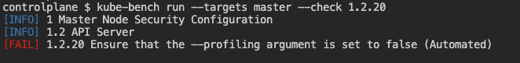

# CKS 이론

## 문제 유형

1. network policy

- deny all 하는 문제가 있으며, development 네임스페이스의 모든 파드에 대해서 진행, egress

- 패캠에서는 label 기반으로 통제하는 것을 배웟는데 문제는 시험에는 label이 없음

- 그래서 메타데이터 상 name 밑에 namespace를 두고 생성 > 실제로 테스트 해보니 egress 잘먹혀서 이렇게 일단 고

2. securityContainer

- Dockerfile (2개 수정)

- 베이스 이미지 ubunta latest > ubuntu 22.04 문제에 나옴

- 문제는 USER ROOT를 사용하는데 이건 문제가 있는데 어떻게 고쳐야하는건지 모르겠음 ? 사용자를 제시안해주는것 같은데..

- Deployment yaml (2개 수정)

- 65535 uid 사용하라고 되어있고 2개 찾으라는데 못찾음

3. gVisor container runtime

- 해당 런타임클래스 생성하고 파드에 적용시키면 끝

4. Audit 로그

- 기존에 하던대로 config 넣고 진행

5. CIS-benchmark

- 이미 벤치마크 된거에 대해서 수정하라고 함 (문제에 다 주어짐)

- kubelet > 반드시 수정한 내용을 적용하기 위해서 systemctl restart kubelet 할것

- api-server 수정

6. secret 생성

- 기존에 생성된 시크릿에 대한 base64 -d 디코딩 작업

- 새로운 secret 생성

7. service account

- role 생성

- rolebinding 생성 (참고로 kubernetes 공식문서에 rolebinding cli 예시가 clusterrole로 나와있어서 주의요함, role로 바꿔적어야함)

- pod에 있는 sa를 알아서 찾은 다음 그 sa에 rolebinding 진행할 것

8. network policy

- 생성하는거 나옴

9. trivy 취약점

- trivy 스캔후 high, critical 파드 제거 (순간 잘못지워서........... 그냥 똑같은 파드 하나 내가 임의로 만들어버림..)

10. sysdig / falco

- 난 sysdig 이용해서 사용했는데 container id를 crictl로 확인해서 분명 명령어 쳤으나 안되서 container name으로 변경

- proc.name / uid 혹은 username / timestamp를 주어지는데 값이 이상하긴 했음..

11. app armor

- parser로 일단 policy 등록하고, yaml 만들어서 등록함.

- aa-status로 잘되는지 확인

12. Container Immutability

- 일단 readOnlyRootFilesystem랑 특정 uid 사용, allowPrivilegeEscalation 적용에 대해서 하라고 함.

13. audit log

- 기존에 있는 audit로그를 적용하면서 etcd랑 apiserver 변경하는것같았음

14. etcd / api-server tls 적용

- 적용될 tls 내용을 주니까 그걸 사용하면될 것 같고

etcd의 경우는 -- cipher-suite 이런걸로 쓰는것 같길래 이걸로 옵션적용. etcd가 잘뜨는지 확인햇음.

나머지 2개는 잘 기억안남

추후 참고

[https://jonathan18186.medium.com/certified-kubernetes-security-specialist-cks-preparation-part-5-microservice-vulnerabilities-b5284a46d6bc](https://jonathan18186.medium.com/certified-kubernetes-security-specialist-cks-preparation-part-5-microservice-vulnerabilities-b5284a46d6bc)

[https://velog.io/@comeonyo/CKS-%EC%8B%9C%ED%97%98-%EB%B2%94%EC%9C%84-%EC%A0%95%EB%A6%AC](https://velog.io/@comeonyo/CKS-%EC%8B%9C%ED%97%98-%EB%B2%94%EC%9C%84-%EC%A0%95%EB%A6%AC)

참고

[CKS 문제 공유](https://devops-james.tistory.com/m/233)

# 이론

인증서파일 위치

/etc/kubernetes/pki에 위치한 파일

Etcd 인증서는

/etc/kubernetes/pki/etcd

스케줄러 위치 api

/etc/kubernetes/scheduler.conf

컨트롤러 위치 api

/etc/kubernetes/controller-manager.conf

kubelet 위치 api

/etc/kubernetes/kubelet.conf 에서 확인가능

/var/lib/kubelet/pki/kubelet-client-current.pem

kubelet server cert

워커노드에  /var/lib/kubelet/pki/kubelet-client-current.pem

container 툴

Docker: Container Runtime + Tool for managing containers and images
Containerd: Container Runtime
Crictl: CLI for CRI-compatible Container Runtimes

   /etc/crictl.yaml
Podman: Tool for managing containers and images

컨테이너를 생성하면 커널에서 조회가 가능하다.

컨테이너 1의 pid와 컨테이너 2의 Pid는 구분이 되는데 하나의 프로세스에서 올라갈 수 있는 방법

```jsx
docker run --name c1 -d nginx:alpine sh -c "sleep 999d"
docker run --name c2 --pid=container:c1 -d nginx:alpine sh -c "sleep 999d"

docker exec c2 ps aux
docker exec c1 ps aux
```

## 문제

There are existing *Pods* in *Namespace* `app` .

We need a new default-deny *NetworkPolicy* named `deny-out` for all outgoing traffic from *Namespace* `app` .

It should still allow DNS traffic on port `53` TCP and UDP.

Namespace app 에 기존 Pod가 있습니다. Namespace app 에서 나가는 모든 트래픽에 대해 거부라는 이름의 새로운 기본 거부 NetworkPolicy가 필요합니다. 포트 53 TCP 및 UDP에서 DNS 트래픽을 계속 허용해야 합니다.

```jsx
apiVersion: networking.k8s.io/v1
kind: NetworkPolicy
metadata:
  name: deny-out
  namespace: app
spec:
  podSelector: {}
  policyTypes:
  - Egress
  egress:
  - ports:
    - port: 53
      protocol: TCP
    - port: 53
      protocol: UDP
```

## 문제

There are existing *Pods* in *Namespace* `space1` and `space2` .We need a new *NetworkPolicy* named `np` that restricts all *Pods* in *Namespace* `space1` to only have outgoing traffic to *Pods* in *Namespace* `space2` . Incoming traffic not affected.We also need a new *NetworkPolicy* named `np` that restricts all *Pods* in *Namespace* `space2` to only have incoming traffic from *Pods* in *Namespace* `space1` . Outgoing traffic not affected.The *NetworkPolicies* should still allow outgoing DNS traffic on port `53` TCP and UDP.

1.`k get ns --show-labels`

2.

```jsx
apiVersion: networking.k8s.io/v1
kind: NetworkPolicy
metadata:
  name: np
  namespace: space1
spec:
  podSelector: {}
  policyTypes:
  - Egress
  egress:
  - to:
     - namespaceSelector:
        matchLabels:
         kubernetes.io/metadata.name: space2
  - ports:
    - port: 53
      protocol: TCP
    - port: 53
      protocol: UDP
```

3.

```jsx
apiVersion: networking.k8s.io/v1
kind: NetworkPolicy
metadata:
  name: np
  namespace: space2
spec:
  podSelector: {}
  policyTypes:
  - Ingress
  ingress:
   - from:
     - namespaceSelector:
        matchLabels:
         kubernetes.io/metadata.name: space1
```

---

TIP 

**What Is the Difference Between Kubectl-Proxy and Kubectl Port-Forward?**

- Kubectl-proxy creates a proxy server between your local computer and the Kubernetes API server. This means that any requests made to the Kubernetes API server by the client are forwarded through the proxy.
The main use case of **"**kubectl proxy**"** is to access the Kubernetes API server.
On the other hand, the **"**kubectl port-forward**"** command creates a tunnel from a local port on your machine to the target port on the Pod. This is especially useful when you want to access a specific Pod directly, like when debugging an application for example.
In summary, **"**kubectl proxy**"** is more suitable for general cluster access, while **"**kubectl port-forward**"** is better for targeting specific Pods.
    
    Kubectl-proxy는 로컬 컴퓨터와 Kubernetes API 서버 사이에 프록시 서버를 생성합니다. 이는 클라이언트가 Kubernetes API 서버에 보낸 모든 요청이 프록시를 통해 전달됨을 의미합니다.
    
     "kubectl 프록시"의 주요 사용 사례는 Kubernetes API 서버에 액세스하는 것입니다. 반면에 'kubectl port-forward' 명령은 머신의 로컬 포트에서 포드의 대상 포트까지 터널을 생성합니다. 
    
    이는 예를 들어 애플리케이션을 디버깅할 때와 같이 특정 Pod에 직접 액세스하려는 경우 특히 유용합니다. 
    
    요약하면, "kubectl Proxy"는 일반 클러스터 액세스에 더 적합하고, "kubectl port-forward"는 특정 포드를 대상으로 하는 데 더 적합합니다.
    

port-forward는 Pod와 통신을 위해

proxy는 kube-apiserver와 통신을 위해

사용 예제 -kubectl port-forward 

[https://kodekloud.com/blog/port-forwarding-kubernetes/](https://kodekloud.com/blog/port-forwarding-kubernetes/)

- 도메인이 없는 경우 curl 로 지정해줘서 날려보내기
- curl [https://domain](https://domain):port/path  -k  —resolve domain:IP
    
    

## 문제

There are two existing *Deployments* in *Namespace* `world` which should be made accessible via an *Ingress*.
First: create ClusterIP *Services* for both *Deployments* for port `80` . The *Services* should have the same name as the *Deployments*.

```jsx
kubectl expose deploy -n word  asia --port 80 --type ClusterIP

```

**추가**

The Nginx Ingress Controller has been installed.

Create a new *Ingress* resource called `world` for domain name `world.universe.mine` . The domain points to the K8s Node IP via `/etc/hosts` .

The *Ingress* resource should have two routes pointing to the existing *Services*:

`http://world.universe.mine:30080/europe/`

and

`http://world.universe.mine:30080/asia/`

```jsx
kubectl get ingressclass -A 

-----------
apiVersion: networking.k8s.io/v1
kind: Ingress
metadata:
  name: world
  namespace: world
spec:
  ingressClassName: nginx # k get ingressclass
  rules:
  - host: "world.universe.mine"
    http:
      paths:
      - path: /europe
        pathType: Prefix
        backend:
          service:
            name: europe
            port:
              number: 80
      - path: /asia
        pathType: Prefix
        backend:
          service:
            name: asia
            port:
              number: 80
```

## 문제

Make sure to have solved the previous Scenario [Ingress Create](https://killercoda.com/killer-shell-cks/scenario/ingress-create).

The Nginx Ingress Controller has been installed and an *Ingress* resource configured in *Namespace* `world` .

You can reach the application using

`curl http://world.universe.mine:30080/europe`

Generate a new TLS certificate using:

`openssl req -x509 -nodes -days 365 -newkey rsa:2048 -keyout cert.key -out cert.crt -subj "/CN=world.universe.mine/O=world.universe.mine"`

Configure the *Ingress* to use the new certificate, so that you can call

`curl -kv https://world.universe.mine:30443/europe`

The curl verbose output should show the new certificate being used instead of the default *Ingress* one.

```jsx
openssl req -x509 -nodes -days 365 -newkey rsa:2048 -keyout cert.key -out cert.crt -subj "/CN=world.universe.mine/O=world.universe.mine"
kubectl create secret tls tls -n world  --cert=cert.crt --key=cert.key

---
apiVersion: networking.k8s.io/v1
kind: Ingress
metadata:
  name: world
  namespace: world
spec:
  ingressClassName: nginx
  rules:
  - host: world.universe.mine
    http:
      paths:
      - backend:
          service:
            name: europe
            port:
              number: 80
        path: /europe
        pathType: Prefix
      - backend:
          service:
            name: asia
            port:
              number: 80
        path: /asia
        pathType: Prefix
  tls:
  - hosts:
    - world.universe.mine
    secretName: tls

```

## 문제

Cloud providers can have Metadata Servers which expose critical information, for example [GCP](https://cloud.google.com/compute/docs/metadata/overview) or [AWS](https://docs.aws.amazon.com/AWSEC2/latest/UserGuide/instancedata-data-retrieval.html).For this task we assume that there is a Metadata Server at `1.1.1.1` .
You can test connection to that IP using `nc -v 1.1.1.1 53` .
Create a *NetworkPolicy* named `metadata-server` In *Namespace* `default` which restricts all egress traffic to that IP.
The *NetworkPolicy* should only affect *Pods* with label `trust=nope` .

```jsx
k get pod -L trust

---
apiVersion: networking.k8s.io/v1
kind: NetworkPolicy
metadata:
  name: metadata-server
  namespace: default
spec:
  podSelector:
    matchLabels:
      trust: nope
  policyTypes:
  - Egress
  egress:
  - to:
    - ipBlock:
        cidr: 0.0.0.0/0
        except:
          - 1.1.1.1/32
```

K8S 벤치마크 툴  kube-bench

[CIS_Kubernetes_Benchmark_v1.6.0.pdf](../CIS_Kubernetes_Benchmark_v1.6.0.pdf)

```jsx
# how to run
https://github.com/aquasecurity/kube-bench/blob/main/docs/running.md

# run on master
docker run --pid=host -v /etc:/etc:ro -v /var:/var:ro -t aquasec/kube-bench:latest run --targets=master --version 1.22

# run on worker
docker run --pid=host -v /etc:/etc:ro -v /var:/var:ro -t aquasec/kube-bench:latest run --targets=node --version 1.22
```

## 문제

Use `kube-bench` to ensure 1.2.20 has status PASS.

```jsx
# see all
kube-bench run --targets master

# or just see the one
kube-bench run --targets master --check 1.2.20
```



```jsx
vi /etc/kubernetes/manifests/kube-apiserver.yaml
...
containers:
  - command:
    - kube-apiserver
    - --profiling=false
```

원하는 release 다운로드 

주소 : https://github.com/kubernetes/kubernetes

tags 를 눌러 원하는 릴리즈를 선택  

additional binarty downloads are linked in the  changelog/changelog-1.19.md  눌러 접근

서버 바이너리에서 > wget을 하여 가져온다.

```jsx
sha512sum  [파일이름] > [new name]

```

## 문제

Download the `kubelet` binary in the same version as the installed one.
`wget https://dl.k8s.io/vX.Y.Z/kubernetes-server-linux-amd64.tar.gz`
Compare their sha hashes and answer with:
`echo SAME > /answer`
`echo DIFFERENT > /answer`

```jsx
VERSION = $(kubelet --version |cut -d ' ' -f2 )
wget https://dl.k8s.io/$VERSION/kubernetes-server-linux-amd64.tar.gz
tar xzf kubernetes-server-linux-amd64.tar.gz

--
whereis kubelet
sha512sum /usr/bin/kubelet
sha512sum kubernetes/server/bin/kubelet
```

## 문제 NP- metaserver in CSP

Cloud providers can have Metadata Servers which expose critical information, for example [GCP](https://cloud.google.com/compute/docs/metadata/overview) or [AWS](https://docs.aws.amazon.com/AWSEC2/latest/UserGuide/instancedata-data-retrieval.html).

For this task we assume that there is a Metadata Server at `1.1.1.1` .

You can test connection to that IP using `nc -v 1.1.1.1 53` .

Create a *NetworkPolicy* named `metadata-server` In *Namespace* `default` which restricts all egress traffic to that IP.

The *NetworkPolicy* should only affect *Pods* with label `trust=nope` .

```jsx
apiVersion: networking.k8s.io/v1
kind: NetworkPolicy
metadata:
  name: metadata-server
  namespace: default
spec:
  podSelector:
    matchLabels:
      trust: nope
  policyTypes:
  - Egress
  egress:
  - to:
    - ipBlock:
        cidr: 0.0.0.0/0
        except:
          - 1.1.1.1/32
```


## 문제 RBAC 1

There are existing Namespaces ns1 and ns2 .

Create ServiceAccount pipeline in both Namespaces.

These SAs should be allowed to view almost everything in the whole cluster. You can use the default ClusterRole view for this.

These SAs should be allowed to create and delete Deployments in their Namespace.

Verify everything using kubectl auth can-i .


~~~
k -n ns1 create sa pipeline
k -n ns2 create sa pipeline

# use ClusterRole view
k get clusterrole view # there is default one
k create clusterrolebinding pipeline-view --clusterrole view --serviceaccount ns1:pipeline --serviceaccount ns2:pipeline

# manage Deployments in both Namespaces
k create clusterrole -h # examples
k create clusterrole pipeline-deployment-manager --verb create,delete --resource deployments
# instead of one ClusterRole we could also create the same Role in both Namespaces

k -n ns1 create rolebinding pipeline-deployment-manager --clusterrole pipeline-deployment-manager --serviceaccount ns1:pipeline
k -n ns2 create rolebinding pipeline-deployment-manager --clusterrole pipeline-deployment-manager --serviceaccount ns2:pipeline

# namespace ns1 deployment manager
k auth can-i delete deployments --as system:serviceaccount:ns1:pipeline -n ns1 # YES
k auth can-i create deployments --as system:serviceaccount:ns1:pipeline -n ns1 # YES
k auth can-i update deployments --as system:serviceaccount:ns1:pipeline -n ns1 # NO
k auth can-i update deployments --as system:serviceaccount:ns1:pipeline -n default # NO

# namespace ns2 deployment manager
k auth can-i delete deployments --as system:serviceaccount:ns2:pipeline -n ns2 # YES
k auth can-i create deployments --as system:serviceaccount:ns2:pipeline -n ns2 # YES
k auth can-i update deployments --as system:serviceaccount:ns2:pipeline -n ns2 # NO
k auth can-i update deployments --as system:serviceaccount:ns2:pipeline -n default # NO

# cluster wide view role
k auth can-i list deployments --as system:serviceaccount:ns1:pipeline -n ns1 # YES
k auth can-i list deployments --as system:serviceaccount:ns1:pipeline -A # YES
k auth can-i list pods --as system:serviceaccount:ns1:pipeline -A # YES
k auth can-i list pods --as system:serviceaccount:ns2:pipeline -A # YES
k auth can-i list secrets --as system:serviceaccount:ns2:pipeline -A # NO (default view-role doesn't allow)
~~~
tip: 
Role + RoleBinding (available in single Namespace, applied in single Namespace)
ClusterRole + ClusterRoleBinding (available cluster-wide, applied cluster-wide)
ClusterRole + RoleBinding (available cluster-wide, applied in single Namespace)
Role + ClusterRoleBinding (NOT POSSIBLE: available in single Namespace, applied cluster-wide)


## 문제 RBAC 2

There is existing Namespace applications .

User smoke should be allowed to create and delete Pods, Deployments and StatefulSets in Namespace applications.
User smoke should have view permissions (like the permissions of the default ClusterRole named view ) in all Namespaces but not in kube-system .
User smoke should be allowed to retrieve available Secret names in Namespace applications. Just the Secret names, no data.
Verify everything using kubectl auth can-i .

~~~
⁣1) RBAC for Namespace applications


k -n applications create role smoke --verb create,delete --resource pods,deployments,sts
k -n applications create rolebinding smoke --role smoke --user smoke

⁣2) view permission in all Namespaces but not kube-system


As of now it’s not possible to create deny-RBAC in K8s

So we allow for all other Namespaces


k get ns # get all namespaces
k -n applications create rolebinding smoke-view --clusterrole view --user smoke
k -n default create rolebinding smoke-view --clusterrole view --user smoke
k -n kube-node-lease create rolebinding smoke-view --clusterrole view --user smoke
k -n kube-public create rolebinding smoke-view --clusterrole view --user smoke

⁣3) just list Secret names, no content


This is NOT POSSIBLE using plain K8s RBAC. You might think of doing this:


# NOT POSSIBLE: assigning "list" also allows user to read secret values
k -n applications create role list-secrets --verb list --resource secrets

k -n applications create rolebinding ...

Having the list verb you can simply run kubectl get secrets -oyaml and see all content. Dangerous misconfiguration!
~~~


## 문제 key&csr1
The idea here is to create a new "user" that can communicate with K8s.

For this now:

Create a new KEY at /root/60099.key for user named 60099@internal.users
Create a CSR at /root/60099.csr for the KEY

~~~
openssl genrsa -out 60099.key 2048

openssl req -new -key 60099.key -out 60099.csr
# set Common Name = 60099@internal.users
~~~

Manually sign the CSR with the K8s CA file to generate the CRT at /root/60099.crt .

Create a new context for kubectl named 60099@internal.users which uses this CRT to connect to K8s.

~~~
openssl x509 -req -in 60099.csr -CA /etc/kubernetes/pki/ca.crt -CAkey /etc/kubernetes/pki/ca.key -CAcreateserial -out 60099.crt -days 500
k config set-credentials 60099@internal.users --client-key=60099.key --client-certificate=60099.crt
k config set-context 60099@internal.users --cluster=kubernetes --user=60099@internal.users
k config get-contexts
k config use-context 60099@internal.users
k get ns
~~~


## 문제 key&csr2
The idea here is to create a new "user" that can communicate with K8s.

For this now:

Create a new KEY at /root/60099.key for user named 60099@internal.users
Create a CSR at /root/60099.csr for the KEY
~~~
openssl genrsa -out 60099.key 2048

openssl req -new -key 60099.key -out 60099.csr
# set Common Name = 60099@internal.users
~~~
Create a K8s CertificateSigningRequest resource named 60099@internal.users and which sends the /root/60099.csr to the API.

Let the K8s API sign the CertificateSigningRequest.

Download the CRT file to /root/60099.crt .

Create a new context for kubectl named 60099@internal.users which uses this CRT to connect to K8s.


## 문제 서비스 어카운트
Modify the default ServiceAccount in Namespace two to prevent any Pod that uses it from mounting its token by default.

Apply the Pod configuration file /opt/ks/pod-two.yaml to Namespace two .

Verify that the ServiceAccount token hasn't been mounted into the Pod.

~~~
To modify the default ServiceAccount you need to run the following command:

kubectl -n two edit sa default

The following property is then added to the ServiceAccount configuration:

apiVersion: v1
kind: ServiceAccount
automountServiceAccountToken: false
metadata:
...

To verify that the token hasn't been mounted run the following commands:

kubectl -n two exec -it pod-two -- mount | grep serviceaccount

kubectl -n two exec -it pod-two -- cat /var/run/secrets/kubernetes.io/serviceaccount/token

Expected result:

cat: /var/run/secrets/kubernetes.io/serviceaccount/token: No such file or directory
~~~

## 문제 API Server  Crash
The idea here is to misconfigure the Apiserver in different ways, then check possible log locations for errors.

You should be very comfortable with situations where the Apiserver is not coming back up.

Configure the Apiserver manifest with a new argument --this-is-very-wrong .

Check if the Pod comes back up and what logs this causes.

Fix the Apiserver again.

~~~
# always make a backup !
cp /etc/kubernetes/manifests/kube-apiserver.yaml ~/kube-apiserver.yaml.ori

# make the change
vim /etc/kubernetes/manifests/kube-apiserver.yaml

# wait till container restarts
watch crictl ps

# check for apiserver pod
k -n kube-system get pod

Apiserver is not coming back, we messed up!


# check pod logs
cat /var/log/pods/kube-system_kube-apiserver-controlplane_a3a455d471f833137588e71658e739da/kube-apiserver/X.log
> 2022-01-26T10:41:12.401641185Z stderr F Error: unknown flag: --this-is-very-wrong

Now undo the change and continue


# smart people use a backup
cp ~/kube-apiserver.yaml.ori /etc/kubernetes/manifests/kube-apiserver.yaml

# wait till container restarts
watch crictl ps

# check for apiserver pod
k -n kube-system get pod


~~~

## 문제 API server false
Make sure to have solved the previous Scenario Apiserver Crash.

The Apiserver is not coming up, the manifest is misconfigured in 3 places. Fix it.

~~~

Log Locations

Log locations to check:

/var/log/pods
/var/log/containers
crictl ps + crictl logs
docker ps + docker logs (in case when Docker is used)
kubelet logs: /var/log/syslog or journalctl
Issues

For your changes to apply you might have to:

move the kube-apiserver.yaml out of the manifests directory
wait for apiserver container to be gone (watch crictl ps )
move the manifest back in and wait for apiserver coming back up
Some users report that they need to restart the kubelet (service kubelet restart ) but in theory this shouldn't be necessary.


Solution 1

The kubelet cannot even create the Pod/Container. Check the kubelet logs in syslog for issues.


cat /var/log/syslog | grep kube-apiserver

There is wrong YAML in the manifest at metadata;


Solution 2

After fixing the wrong YAML there still seems to be an issue with a wrong parameter.


Check logs in /var/log/pods.
Error: Error: unknown flag: --authorization-modus.
The correct parameter is --authorization-mode.
Solution 3

After fixing the wrong parameter, the pod/container might be up, but gets restarted.


Check container logs or /var/log/pods, where we should find:


Error while dialing dial tcp 127.0.0.1:23000: connect:connection refused

Check the container logs: the ETCD connection seems to be wrong. Set the correct port on which ETCD is running (check the ETCD manifest)


It should be --etcd-servers=https://127.0.0.1:2379

~~~


## 문제
The Kubelet on node01 shouldn't be able to set Node labels

starting with node-restriction.kubernetes.io/*
on other Nodes than itself
Verify this is not restricted atm by performing the following actions as the Kubelet from node01 :

add label killercoda/one=123 to Node controlplane
add label node-restriction.kubernetes.io/one=123 to Node node01

~~~

Tip
----
We can contact the Apiserver as the Kubelet by using the Kubelet kubeconfig

----
export KUBECONFIG=/etc/kubernetes/kubelet.conf
k get node


Solution
---
ssh node01
    export KUBECONFIG=/etc/kubernetes/kubelet.conf
    k label node controlplane killercoda/one=123 # works but should be restricted
    k label node node01 node-restriction.kubernetes.io/one=123 # works but should be restricted
~~~


## master / worker node  upgrade
링크: https://kubernetes.io/docs/tasks/administer-cluster/kubeadm/kubeadm-upgrade/


~~~
1. 마스터 노드 드레인
kubectl drain masternode  --ignore-daemonsets

2. apt upgrade
apt-get upgrade 

apt-cache show kubeadm |grep 1.22
retuen :  Version : 1.22.5-00

apt-mark  hold kubectl kubelet


apt-mark unhold kubeadm

apt-get install kubeadm=1.22.5-00

kubeadm version

kubeadm upgrade plan

kubeadm upgrade apply v1.22.5

apt-mark unhold kubelet kubectl

apk-get install kubelet=1.22.5-00 kubectl=1.22.5-00

service kubelet restart 

kubectl uncordon masternode


2. 워커노드 업그레이드
kubectl drain workernode --ignore-daemonsets

apt-get update 

apt-cache  show kubeadm |grep 1.22
return: Version 1.22.5-00

apt-mark hold kubelet kubectl

apt-mark unhold kubeadm

apt-get install kubeadm=1.22.5-00

kubeadm upgrade node

apt-mark hold kubeadm

apt-mark unhold kubelet kubectl

apt-get install kubelet=1.22.5-00 kubectl=1.22.5-00

apt-mark hold kubelet kubectl 

service kubelet restart 

~~~


## 문제 Secret

1.
Create a Secret named holy with content creditcard=1111222233334444
Create Secret from file /opt/ks/secret-diver.yaml
~~~
kubectl create secret generic holy --from-literal creditcard=1111222233334444
kubectl -f /opt/ks/secret-diver.yaml create
~~~


2.
Create a Pod named pod1 of image nginx
Make Secret holy available as environment variable HOLY
Mount Secret diver as volume. The file should be available under /etc/diver/hosts .
Test env+volume access in the running Pod
~~~
apiVersion: v1
kind: Pod
metadata:
  name: pod1
spec:
  volumes:
  - name: diver
    secret:
      secretName: diver
  containers:
  - image: nginx
    name: pod1
    volumeMounts:
      - name: diver
        mountPath: /etc/diver
    env:
      - name: HOLY
        valueFrom:
          secretKeyRef:
            name: holy
            key: creditcard
~~~
~~~

- apiVersion: v1
  data:
    hosts: MTI3LjAuMC4xCWxvY2FsaG9zdAoxMjcuMC4xLjEJaG9zdDAxCgojIFRoZSBmb2xsb3dpbmcgbGluZXMgYXJlIGRlc2lyYWJsZSBmb3IgSVB2NiBjYXBhYmxlIGhvc3RzCjo6MSAgICAgbG9jYWxob3N0IGlwNi1sb2NhbGhvc3QgaXA2LWxvb3BiYWNrCmZmMDI6OjEgaXA2LWFsbG5vZGVzCmZmMDI6OjIgaXA2LWFsbHJvdXRlcnMKMTI3LjAuMC4xIGhvc3QwMQoxMjcuMC4wLjEgaG9zdDAxCjEyNy4wLjAuMSBob3N0MDEKMTI3LjAuMC4xIGNvbnRyb2xwbGFuZQoxNzIuMTcuMC4zNSBub2RlMDEKMTcyLjE3LjAuMjMgY29udHJvbHBsYW5lCg==
  kind: Secret
  metadata:
    creationTimestamp: "2024-02-14T07:21:04Z"
    name: diver
    namespace: default
    resourceVersion: "3786"
    uid: 3917b7e1-955e-4116-8370-8d26a8858413
  type: Opaque

- apiVersion: v1
  data:
    creditcard: MTExMTIyMjIzMzMzNDQ0NA==
  kind: Secret
  metadata:
    creationTimestamp: "2024-02-14T07:20:57Z"
    name: holy
    namespace: default
    resourceVersion: "3778"
    uid: 34ab9568-c606-4bf4-8f68-5066d4fc4fba
  type: Opaque
~~~

## 문제  secret 읽기
Get the Secrets of type Opaque that have been created in Namespace one .

Create a new file called /opt/ks/one and store the base64-decoded values in that file. Each value needs to be stored on a new line.
~~~
kubectl -n one get secret s1 -ojsonpath="{.data.data}" | base64 -d

kubectl -n one get secret s2 -ojsonpath="{.data.data}" | base64 -d
~~~


## 문제 secret serviceAccount
Create new Namespace ns-secure and perform everything 

following in there

Create ServiceAccount secret-manager

Create Secret sec-a1 with any literal content of your choice

Create Secret sec-a2 with any file content of your choice 
(like /etc/hosts )

~~~
k create ns ns-secure

k -n ns-secure create sa secret-manager

k -n ns-secure create secret generic sec-a1 --from-literal user=admin

k -n ns-secure create secret generic sec-a2 --from-file index=/etc/hosts
~~~

In Namespace ns-secure create Pod secret-manager with image 
httpd:alpine which uses the new ServiceAccount

Make Secret sec-a1 available as environment variable SEC_A1

Mount Secret sec-a2 into the Pod read-only under /etc/sec-a2

Verify your solution worked
~~~
apiVersion: v1
kind: Pod
metadata:
  labels:
    run: secret-manager
  name: secret-manager
  namespace: ns-secure
spec:
  volumes:
    - name: sec-a2
      secret:
        secretName: sec-a2
  serviceAccountName: secret-manager
  containers:
    - image: httpd:alpine
      name: secret-manager
      volumeMounts:
        - name: sec-a2
          mountPath: /etc/sec-a2
          readOnly: true
      env:
        - name: SEC_A1
          valueFrom:
            secretKeyRef:
              name: sec-a1
              key: user
  dnsPolicy: ClusterFirst
  restartPolicy: Always
~~~


## 문제  ETCD Entryption
Create an EncryptionConfiguration file at /etc/kubernetes/etcd/ec.yaml and make ETCD use it.


One provider should be of type aesgcm with password this-is-very-sec . All new secrets should be encrypted using this one.


One provider should be the identity one to still be able to read existing unencrypted secrets.

~~~
Generate EncryptionConfiguration:

mkdir -p /etc/kubernetes/etcd
echo -n this-is-very-sec | base64
apiVersion: apiserver.config.k8s.io/v1
kind: EncryptionConfiguration
resources:
  - resources:
    - secrets
    providers:
    - aesgcm:
        keys:
        - name: key1
          secret: dGhpcy1pcy12ZXJ5LXNlYw==
    - identity: {}

1. Add a new volume and volumeMount in /etc/kubernetes/manifests/kube-apiserver.yaml, so that the container can access the file.

2. Pass the new file as argument: --encryption-provider-config=/etc/kubernetes/etcd/ec.yaml

spec:
  containers:
  - command:
    - kube-apiserver
...
    - --encryption-provider-config=/etc/kubernetes/etcd/ec.yaml
...
    volumeMounts:
    - mountPath: /etc/kubernetes/etcd
      name: etcd
      readOnly: true
...
  hostNetwork: true
  priorityClassName: system-cluster-critical
  volumes:
  - hostPath:
      path: /etc/kubernetes/etcd
      type: DirectoryOrCreate
    name: etcd
...

Wait till apiserver was restarted:

watch crictl ps
~~~