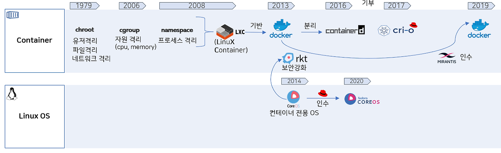

#  쿠버네티스 probe란

## 종류
- Probe는 pod의 health check를 수행하며  문제가 있으면 재기동 같은 후속 액션을 위한 pod 하위 옵션이다. 종류는 3가지로 나뉘며 쓰이는 역할을 알아보자.
시작되는지 /  트래픽을 받을 수 있는지 / 옳바르게 동작하는지 확인을 위한 것이다.

### startprobe
 - startup Probe는 Container 가 올바르게 시작되었는지 확인하는 데 사용됩니다. Kubernetes는 시작 단계 동안 주기적으로 Health Check 요청을 Container 로 보냅니다. 준비가 되었다는 응답 코드를 수신하면 Kubernetes는 해당 Container 가 정상적으로 기동되었다고 판단합니다. 지정된 시간 초과 내에 응답을 수신하지 못하면 Kubernetes가 컨테이너를 다시 시작합니다. 이를 통해 Liveness Probe 와 마찬가지로, 신뢰성 확보에 기여합니다. 해당 Probe는 컨테이너 생성 시 동작하며, 헬스체크에 성공하면 더 이상 동작하지 않습니다.
### readiness
- container 가 트래픽을 수신할 준비가 되었는지 확인하는 데 사용됩니다. Kubernetes 는 주기적으로 Health Check 요청을 Container 로 보내고, 준비가 되었다는 응답 코드를 수신하면 트래픽을 수신할 준비가 된 컨테이너로 간주합니다. 그 외에 다른 코드를 받으면 Kubernetes 는 트래픽을 수신할 준비가 될 때까지 로드 밸런서 풀에서 해당 Container 를 제거합니다. 이를 통해, Container 가 사용 가능한 상태인지를 실시간으로 확인하고, 사용 가능하지 않은 Pod에 대한 요청을 차단하여 가용성 확보에 기여합니다.

### liveness 
 - Container 가 활성화되어 올바르게 작동하는지 확인합니다. Kubernetes 는 주기적으로 Container 에 Health Check 요청을 Container 로 보내고 지정된 Timeout 시간 내에 응답을 받지 못하면 Container를 재기동 시킵니다. 이를 통해 Pod의 상태를 실시간으로 모니터링하고, 문제가 발생한 경우 적시에 대응할 수 있습니다. 이는 Container 가 제대로 작동하지 않는 상황을 방지하여 신뢰성 확보에 기여합니다.

## 실습
### 실습 예제 설치
~~~
---
apiVersion: v1
kind: Namespace
metadata:
  name: anotherclass-123
  labels:
    part-of: k8s-anotherclass
    managed-by: dashboard
---
apiVersion: apps/v1
kind: Deployment
metadata:
  namespace: anotherclass-123
  name: api-tester-1231
  labels:
    part-of: k8s-anotherclass
    component: backend-server
    name: api-tester
    instance: api-tester-1231
    version: 1.0.0
    managed-by: dashboard
spec:
  selector:
    matchLabels:
      part-of: k8s-anotherclass
      component: backend-server
      name: api-tester
      instance: api-tester-1231
  replicas: 2
  strategy:
    type: RollingUpdate
  template:
    metadata:
      labels:
        part-of: k8s-anotherclass
        component: backend-server
        name: api-tester
        instance: api-tester-1231
        version: 1.0.0
    spec:
      nodeSelector:
        kubernetes.io/hostname: k8s-master
      containers:
        - name: api-tester-1231
          image: 1pro/api-tester:v1.0.0
          ports:
          - name: http
            containerPort: 8080
          envFrom:
            - configMapRef:
                name: api-tester-1231-properties
          startupProbe:
            httpGet:
              path: "/startup"
              port: 8080
            periodSeconds: 5
            failureThreshold: 24
          readinessProbe:
            httpGet:
              path: "/readiness"
              port: 8080
            periodSeconds: 10
            failureThreshold: 3
          livenessProbe:
            httpGet:
              path: "/liveness"
              port: 8080
            periodSeconds: 10
            failureThreshold: 3
          resources:
            requests:
              memory: "100Mi"
              cpu: "100m"
            limits:
              memory: "200Mi"
              cpu: "200m"
          volumeMounts:
            - name: files
              mountPath: /usr/src/myapp/files/dev
            - name: secret-datasource
              mountPath: /usr/src/myapp/datasource
      volumes:
        - name: files
          persistentVolumeClaim:
            claimName: api-tester-1231-files
        - name: secret-datasource
          secret:
            secretName: api-tester-1231-postgresql
---
apiVersion: v1
kind: Service
metadata:
  namespace: anotherclass-123
  name: api-tester-1231
  labels:
    part-of: k8s-anotherclass
    component: backend-server
    name: api-tester
    instance: api-tester-1231
    version: 1.0.0
    managed-by: dashboard
spec:
  selector:
    part-of: k8s-anotherclass
    component: backend-server
    name: api-tester
    instance: api-tester-1231
  ports:
    - port: 80
      targetPort: http
      nodePort: 31231
  type: NodePort
​---
apiVersion: v1
kind: ConfigMap
metadata:
  namespace: anotherclass-123
  name: api-tester-1231-properties
  labels:
    part-of: k8s-anotherclass
    component: backend-server
    name: api-tester
    instance: api-tester-1231
    version: 1.0.0
    managed-by: dashboard
data:
  spring_profiles_active: "dev"
  application_role: "ALL"
  postgresql_filepath: "/usr/src/myapp/datasource/postgresql-info.yaml"
---
apiVersion: v1
kind: Secret
metadata:
  namespace: anotherclass-123
  name: api-tester-1231-postgresql
  labels:
    part-of: k8s-anotherclass
    component: backend-server
    name: api-tester
    instance: api-tester-1231
    version: 1.0.0
    managed-by: dashboard
stringData:
  postgresql-info.yaml: |
    driver-class-name: "org.postgresql.Driver"
    url: "jdbc:postgresql://postgresql:5431"
    username: "dev"
    password: "dev123"
---
apiVersion: v1
kind: PersistentVolumeClaim
metadata:
  namespace: anotherclass-123
  name: api-tester-1231-files
  labels:
    part-of: k8s-anotherclass
    component: backend-server
    name: api-tester
    instance: api-tester-1231
    version: 1.0.0
    managed-by: kubectl
spec:
  resources:
    requests:
      storage: 2G
  accessModes:
    - ReadWriteMany
  selector:
    matchLabels:
      part-of: k8s-anotherclass
      component: backend-server
      name: api-tester
      instance: api-tester-1231-files
---
apiVersion: v1
kind: PersistentVolume
metadata:
  name: api-tester-1231-files
  labels:
    part-of: k8s-anotherclass
    component: backend-server
    name: api-tester
    instance: api-tester-1231-files
    version: 1.0.0
    managed-by: dashboard
spec:
  capacity:
    storage: 2G
  volumeMode: Filesystem
  accessModes:
    - ReadWriteMany
  local:
    path: "/root/k8s-local-volume/1231"
  nodeAffinity:
    required:
      nodeSelectorTerms:
        - matchExpressions:
            - {key: kubernetes.io/hostname, operator: In, values: [k8s-master]}
---
apiVersion: autoscaling/v2
kind: HorizontalPodAutoscaler
metadata:
  namespace: anotherclass-123
  name: api-tester-1231-default
  labels:
    part-of: k8s-anotherclass
    component: backend-server
    name: api-tester
    instance: api-tester-1231
    version: 1.0.0
    managed-by: dashboard
spec:
  scaleTargetRef:
    apiVersion: apps/v1
    kind: Deployment
    name: api-tester-1231
  minReplicas: 2
  maxReplicas: 4
  metrics:
    - type: Resource
      resource:
        name: cpu
        target:
          type: Utilization
          averageUtilization: 60
  behavior:
    scaleUp:
      stabilizationWindowSeconds: 120
~~~
출처:https://cafe.naver.com/kubeops

### 로그보기
이전 강의에서 그라파나 - loki를 통해 로그를 보는 방법을 진행했다.

### 로그 설명

- [App 초기화] 중 시스템 연동 작업을 하고, [User 초기화] 중에 초기 데이터 로딩 작업이 있음. 그리고 이 작업이 다 끝나야 [기동완료] 가 되는 App 기동 상황

- startupProbe가 5초 간격으로 호출 되고, 성공할 때까지 반복, 성공 후 readinessProbe와 livenessProbe가 시작

- livenessProbe는 바로 성공을 하지만, readinessProbe는 처음 실패 후에 [기동완료] 가 되서야 성공을 함

- livenessProbe와 readinessProbe는 10초 간격으로 계속 호출 됨

​
### 어플리케이션 동작 중심에 프로브

### API를 통해  동작확인

출처:https://cafe.naver.com/kubeops
- API 호출 명령어
~~~
curl http://192.168.56.30:31231/hello

# 이외 어플리케이션에 테스트  api
// 부하 증가 - (App 내부 isAppReady와 isAppLive를 False로 바꿈)
curl http://192.168.56.30:31231/server-load-on

// 외부 API 실패
curl http://192.168.56.30:31231/hello

// 부하 감소 API - (App 내부 isAppReady와 isAppLive를 True로 바꿈)
curl http://192.168.56.30:31231/server-load-off

~~~

### 응용
1. startupProbe가 실패 되도록 설정해서 Pod가 무한 재기동 상태가 되도록 설정해 보세요. 
- startupProbe에 failureThreshold 수치를 App이 기동안되도록 낮추면 됩니다.
~~~
startupProbe:
  httpGet:
    path: "/startup"
    port: 8080
  periodSeconds: 5
  failureThreshold: 1
readinessProbe:
  httpGet:
    path: "/readiness"
    port: 8080
  periodSeconds: 10
  failureThreshold: 3
livenessProbe:
  httpGet:
    path: "/liveness"
    port: 8080
  periodSeconds: 10
  failureThreshold: 3

~~~
2. 일시적 장애 상황(App 내부 부하 증가)가 시작 된 후, 30초 뒤에 트래픽이 중단되고, 3분 뒤에는 App이 재기동 되도록 설정해 보세요. 
-  livenessProbe에 periodSeconds나 failureThreshold를 늘리면 됩니다.
~~~
startupProbe:
  httpGet:
    path: "/startup"
    port: 8080
  periodSeconds: 5
  failureThreshold: 10
readinessProbe:
  httpGet:
    path: "/readiness"
    port: 8080
  periodSeconds: 10
  failureThreshold: 3
livenessProbe:
  httpGet:
    path: "/liveness"
    port: 8080
  periodSeconds: 60
  failureThreshold: 3

~~~

(아래 API를 날리면 readinessProbe와 livenessProbe가 동시에 실패하게 됩니다)

3. Secret 파일(/usr/src/myapp/datasource/postgresql-info.yaml)이 존재하는지 체크하는 readinessProbe를 만들어 보세요. 

- readinessProbe에는 exec라는 속성으로 command를 Pod에 날릴 수 있고, 이는 App기동시 꼭 필요한 파일이 있는지를 체크합니다

~~~
startupProbe:
  httpGet:
    path: "/startup"
    port: 8080
  periodSeconds: 5
  failureThreshold: 10
readinessProbe:
  exec:
    command: ["cat", "/usr/src/myapp/datasource/postgresql-info.yaml"]
  periodSeconds: 10
  failureThreshold: 3
livenessProbe:
  httpGet:
    path: "/liveness"
    port: 8080
  periodSeconds: 10
  failureThreshold: 3
☞
~~~

참고 자료 : https://kubernetes.io/docs/tasks/configure-pod-container/configure-liveness-readiness-startup-probes/